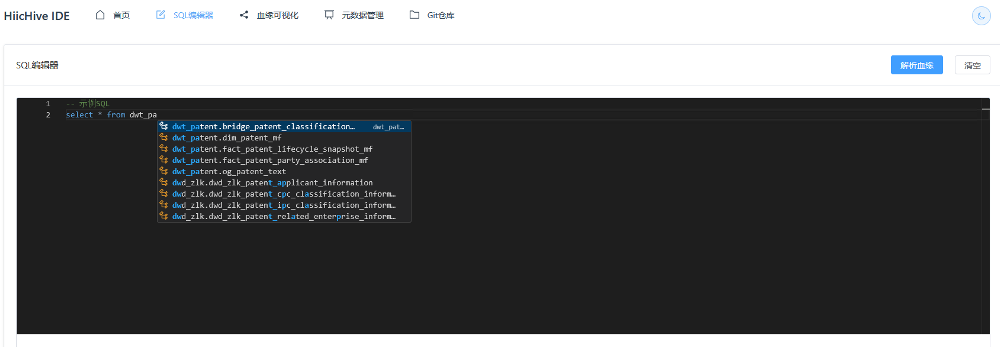

# HiicHiveIDE - 轻量级数据血缘工具

## 项目概述

HiicHiveIDE 是一个专为内部团队使用的轻量级数据血缘分析工具，支持 5-20 人的小型团队。主要功能包括 Hive SQL 血缘关系分析、元数据管理和代码开发功能。

## 界面展示

### 🏠 应用首页

*现代化的首页设计，支持浅色/深色主题切换，柔和渐变背景，功能卡片一目了然*

### ✏️ SQL编辑器

*基于Monaco Editor的智能SQL编辑器，支持语法高亮、自动补全和实时血缘分析*

### 📈 血缘可视化

*双层可视化设计：表级血缘图和字段级血缘图，支持交互操作和图形导出*

### 📊 元数据管理

*完整的元数据管理界面，支持Hive表结构浏览、搜索、导入和业务映射*

### 📁 Git仓库管理

*强大的Git集成功能，支持双模式访问、多种认证方式和智能分支管理*

## 核心特性

- 🔍 **智能血缘分析**: 实时解析 Hive SQL 语句，自动提取表级和字段级血缘关系
- 📊 **元数据管理增强**: 
  - 自动爬取并管理 Hive 表和列信息，提供实时统计数据
  - **字段详情查看**: 点击查看完整表结构，支持字段搜索和备注显示
  - **一键复制表结构**: 复制表的完整字段信息到剪贴板
- 🗑️ **元数据删除管理**: 支持全部清空、指定删除数据库/表及相关血缘关系，级联删除业务映射
- 📁 **手动导入功能**: 支持JSON/CSV/Excel格式元数据文件导入，数据验证和预览，模板下载优化
- 🔗 **选择性Hive连接**: 可视化选择需要同步的表，避免导入无用数据
- 🔧 **Git 集成增强**: 
  - 支持 GitLab/GitHub，内网私有仓库
  - Token认证和用户名密码双重认证方式
  - SSL证书验证可选，适配内网环境
  - 智能分支管理和手动分支选择
  - Windows凭据管理器兼容
  - **双模式访问**: 本地克隆模式 + API访问模式
  - **跨平台优化**: Windows路径权限问题完美解决
  - **仓库管理**: 支持一键删除仓库和本地文件
- ✏️ **SQL 编辑器增强**: 基于 Monaco Editor 的智能 SQL 编辑器，支持：
  - **一键格式化**: 智能SQL代码格式化，提升代码可读性
  - **一键复制**: 快速复制SQL代码到剪贴板
  - **智能自动补全**: 基于SQL上下文的智能提示
    - 根据schema优先补全表名
    - 支持表别名.字段的智能补全
    - FROM/JOIN段优先显示表名，SELECT段优先显示字段名
    - 显示表备注和字段备注信息
    - 自定义建议框宽度，展示更多元数据信息
- 📈 **双层可视化**: 表级血缘图（基于 AntV G6）+ 字段级血缘图（自定义SVG渲染）
- 🎯 **交互式血缘图**: 
  - 字段高亮和连线跟踪
  - 双击复制表名/字段名
  - 全屏模式和重置视角
  - 完整表名显示，不再省略
- 📥 **血缘图导出**: 支持 PNG/SVG 格式下载，便于文档制作和分享
- 📱 **响应式设计**: 完美适配移动端和小屏幕设备
- 🌙 **深色模式优化**: 重新设计配色方案，提升对比度和可读性，优化所有组件视觉效果
- 🎨 **UI体验全面升级**: 
  - **浅色模式优化**: 深色菜单栏、柔和渐变背景、半透明毛玻璃卡片设计
  - **深色模式增强**: 高对比度文字、渐变背景层次、完整组件适配
  - **加载动画修复**: 解决深色模式下转圈方块图案问题
  - **视觉一致性**: CSS变量统一主题切换，多层渐变营造专业视觉效果
- 💡 **界面优化**: 统一卡片高度、优化按钮布局，提升整体视觉体验
- 🔐 **智能认证**: Git认证成功格式记录，避免重复尝试，提升同步效率
- 👥 **用户管理**: 支持多用户独立配置 Git 仓库
- 🚀 **SQLFlow 集成**: 自动启动本地 SQLFlow 解析引擎，端口 19600
- 🗂️ **自动化部署**: 智能数据库初始化和服务管理
- 🔄 **智能同步**: Git仓库状态检测和自动恢复机制
- 💾 **存储优化**: API模式零本地存储，适合空间受限环境
- 🖥️ **Windows优化**: 完美适配Windows服务器部署，解决权限问题

## 技术架构

### 后端架构
- **框架**: Django 5.2.4 + Django REST Framework
- **数据库**: SQLite（适合小团队快速部署）
- **认证**: Django 内置用户系统 + Token 认证
- **血缘解析**: 外部 SQL 解析服务（Gudu SQLFlow）
- **Git 集成**: GitPython
- **Hive 连接**: PyHive + 增强 Kerberos 认证（支持keytab文件、krb5.conf配置和自定义JAR包）

### 前端架构
- **框架**: Vue.js 3 + TypeScript + Composition API
- **UI 组件**: Element Plus（完全响应式）
- **代码编辑器**: Monaco Editor（支持语法高亮和自动补全）
- **图表可视化**: 
  - 表级血缘图: AntV G6
  - 字段级血缘图: 自定义SVG渲染引擎
- **HTTP 客户端**: Axios
- **响应式布局**: 支持移动端和多尺寸屏幕

## 项目结构

```
HiicHiveIDE/
├── hive_ide/                 # Django 主项目配置
├── apps_core/               # 核心应用（认证等）
├── apps_metadata/           # 元数据管理应用
│   ├── models.py           # HiveTable, BusinessMapping 模型
│   ├── hive_crawler.py     # Hive 元数据爬虫
│   ├── views.py            # API 视图（包含自动补全）
│   └── management/commands/ # 管理命令
├── apps_git/               # Git 集成应用
│   ├── models.py          # GitRepo 模型（支持双模式访问）
│   ├── git_service.py     # Git 操作服务（智能模式切换）
│   ├── gitlab_api_service.py # GitLab API 客户端（纯API模式）
│   └── views.py           # Git API 视图（含删除功能）
├── apps_lineage/          # 血缘分析应用
│   ├── models.py         # LineageRelation, ColumnLineage 模型
│   ├── lineage_service.py # 血缘分析服务
│   └── views.py          # 血缘 API 视图
├── frontend/             # Vue.js 前端应用
│   ├── src/components/   # Vue 组件
│   │   ├── LineageGraph.vue      # 血缘可视化主组件
│   │   └── ColumnLineageGraph.vue # 字段级血缘图组件
│   ├── src/views/       # 页面视图（完全响应式）
│   └── src/services/    # API 服务层
└── requirements.txt     # Python 依赖
```

## 安装部署

### 环境要求
- Python 3.8+
- Node.js 16+
- Kerberos 客户端（如需连接 Hive）

### 快速开始

#### 自动化安装（推荐）

1. **克隆项目**
```bash
git clone <repository-url>
cd HiicHiveIDE
```

2. **运行初始化脚本**
```bash
# Linux/macOS
./scripts/init.sh

# Windows
scripts\init.bat
```

3. **启动所有服务**
```bash
# Linux/macOS
./scripts/start.sh

# Windows
scripts\start.bat
```

#### 手动安装

1. **克隆项目**
```bash
git clone <repository-url>
cd HiicHiveIDE
```

2. **安装后端依赖**
```bash
pip install -r requirements.txt
```

3. **数据库初始化**
```bash
python manage.py makemigrations
python manage.py migrate
python manage.py createsuperuser
```

4. **安装前端依赖**
```bash
cd frontend
npm install
```

5. **启动服务**

后端服务：
```bash
python manage.py runserver
```

前端开发服务器：
```bash
cd frontend
npm run dev
```

## 配置说明

### Hive 连接配置
在 `hive_ide/settings.py` 中配置 Hive 连接信息：

```python
HIVE_CONFIG = {
    'host': 'your-hive-host',
    'port': 10000,
    'database': 'default',
    'auth': 'KERBEROS',
    'kerberos_service_name': 'hive',
}
```

**增强的Kerberos认证支持**：
- **Keytab文件上传**: 支持上传.keytab文件，用于Kerberos身份验证
- **krb5.conf配置**: 支持上传Kerberos配置文件，自定义KDC和realm设置
- **自定义JAR包**: 支持上传自定义Hive驱动JAR包，适配特定版本需求
- **多用户配置**: 每个用户可以独立管理自己的认证配置和文件
- **安全存储**: 认证文件按用户隔离存储，自动清理机制防止磁盘泄漏

### SQL 解析服务配置
配置 SQLFlow 解析服务地址（脚本会自动启动本地服务）：

```python
SQLFLOW_CONFIG = {
    'url': 'http://localhost:19600/sqlflow/datalineage',
    'timeout': 30,
    'mock_mode': False,  # 使用真实的SQLFlow服务
}
```

**注意**: SQLFlow 服务会在启动脚本中自动启动，使用本地 jar 包：
```bash
java -jar sqlflow_engine_lite/java_data_lineage-1.1.2.jar --server.host=localhost --server.port=19600
```

## 使用指南

### 1. 元数据管理

**爬取 Hive 元数据**
```bash
python manage.py crawl_metadata
```

**元数据删除管理**
- **全部清空**: 清空所有表信息、业务映射和血缘关系，支持一键重置
- **删除数据库**: 删除指定数据库的所有表和相关血缘关系
- **删除单表**: 删除指定表及其相关的血缘关系和业务映射
- **级联删除**: 自动清理相关的字段级血缘和业务映射关系
- **操作确认**: 所有删除操作都有确认对话框和详细的删除统计信息

**API 端点**
- `GET /api/metadata/tables/` - 获取表列表
- `GET /api/metadata/tables/autocomplete/` - 自动补全接口
- `GET /api/metadata/business-mappings/` - 业务映射管理
- `DELETE /api/metadata/tables/clear_all/` - 清空所有元数据
- `DELETE /api/metadata/tables/delete_database/` - 删除指定数据库
- `DELETE /api/metadata/tables/delete_table/` - 删除指定表

### 2. Git 集成

**配置 Git 仓库**
1. 在前端界面配置 Git 仓库信息
2. 选择认证方式：用户名密码 或 Token认证
3. **选择访问模式**：本地克隆 或 API访问
4. 支持内网私有 GitLab，可关闭 SSL 证书验证
5. 智能分支管理和手动分支选择
6. 一键删除仓库和本地文件
7. **智能认证优化**：记录成功的认证格式，避免重复尝试，提升同步速度

### 3. 元数据管理增强

**手动导入元数据**
1. 在元数据管理页面选择"手动导入"功能
2. 支持三种文件格式：
   - **JSON格式**: 结构化表和字段定义
   - **CSV格式**: 表格式的元数据信息
   - **Excel格式**: .xlsx或.xls文件
3. 数据验证和预览功能，确保导入数据正确性
4. 支持合并模式和跳过模式
5. 可下载标准模板文件

**选择性Hive连接**
1. 配置Hive连接参数（服务器、端口、认证方式）
2. 测试连接并获取数据库结构
3. 可视化树形选择器选择需要同步的表
4. 支持批量选择和取消选择
5. 灵活的同步模式：仅添加新表、更新已存在表、完全同步
6. 实时同步进度和错误反馈

**认证方式**
- **用户名密码认证**: 传统的Git认证方式
- **Token认证**: 使用Personal Access Token，推荐用于GitLab
  - GitLab: User Settings → Access Tokens → Create Personal Access Token
  - 选择适当权限：read_repository

**GitLab配置建议**
- 内网私有 GitLab 建议禁用 SSL 验证
- 使用Token认证避免密码问题
- Windows环境自动处理凭据管理器冲突

**访问模式**
- **本地克隆模式**: 
  - 下载完整仓库到本地
  - 支持所有Git操作和离线工作
  - 适合开发环境和稳定网络
- **API访问模式**: 
  - 零本地存储，纯API获取文件
  - 避免Windows权限问题
  - 适合Windows服务器部署
  - 实时获取最新文件内容

**分支管理**
- 自动检测远程可用分支
- 手动切换分支功能
- 智能默认分支选择（main → master → 第一个可用分支）
- 支持API模式和克隆模式的分支操作

**API 端点**
- `POST /api/git/repos/` - 创建 Git 仓库配置
- `POST /api/git/repos/{id}/sync/` - 同步仓库（克隆模式）
- `DELETE /api/git/repos/{id}/` - 删除仓库和本地文件
- `POST /api/git/repos/{id}/force_reclone/` - 强制重新克隆
- `GET /api/git/repos/{id}/branches/` - 获取分支列表（支持双模式）
- `POST /api/git/repos/{id}/switch_branch/` - 切换分支
- `GET /api/git/repos/{id}/files/` - 获取 SQL 文件列表（支持双模式）

#### 元数据管理 API
```
GET /api/metadata/tables/                    # 表列表
GET /api/metadata/tables/databases/          # 数据库列表  
GET /api/metadata/tables/autocomplete/       # 自动补全
GET /api/metadata/tables/statistics/         # 统计数据
POST /api/metadata/business-mappings/        # 创建业务映射

# 手动导入API
POST /api/metadata/import/import_metadata/   # 导入元数据
GET /api/metadata/import/get_template/       # 获取模板文件

# Hive连接API
POST /api/metadata/hive-connection/test_connection/      # 测试连接
POST /api/metadata/hive-connection/get_databases/       # 获取数据库列表
POST /api/metadata/hive-connection/get_tables/          # 获取表列表
POST /api/metadata/hive-connection/get_database_tree/   # 获取数据库树结构
POST /api/metadata/hive-connection/selective_sync/      # 选择性同步
```

### 3. 血缘分析

**解析单个 SQL（支持实时字段级血缘）**
```bash
POST /api/lineage/parse-sql/
{
    "sql_text": "INSERT INTO target_table SELECT * FROM source_table",
    "file_path": "optional/file/path.sql"
}
```

返回结果包含：
- 表级血缘关系
- 字段级血缘图数据（column_graph）
- 表统计信息

**批量解析仓库（仅匹配现有元数据）**
```bash
POST /api/lineage/parse-repo/
{
    "repo_id": 1
}
```

**重要说明**: Git仓库解析逻辑已优化，现在只会为元数据中已存在的表创建血缘关系，不会创建新的表记录。这确保了Git解析仅用于血缘关联，不涉及库、表、字段的新增。解析日志会显示跳过的表数量和详细信息。

**影响分析**
```bash
GET /api/lineage/impact/?table_name=database.table_name
```

**统计数据获取**
```bash
GET /api/metadata/tables/statistics/
```

### 4. SQL 编辑器增强功能

前端提供基于 Monaco Editor 的智能 SQL 编辑器，支持：
- **一键格式化**: 使用sql-formatter库自动格式化SQL代码，提升可读性
- **一键复制**: 快速复制SQL代码到剪贴板，支持降级兼容
- **智能自动补全**: 基于SQL上下文的智能提示系统
  - 分析当前光标所在的SQL语句段落（SELECT、FROM、JOIN等）
  - 根据schema优先补全表名（如：`dwd_zlk.table_name`）
  - 支持表别名.字段的智能补全（如：`t1.field_name`）
  - FROM/JOIN段优先显示表名，SELECT段优先显示字段名
  - 显示表备注和字段备注信息，建议框宽度优化
- 语法高亮和错误检查
- ~~实时 SQL 解析和血缘分析~~（已移除解析血缘按钮）
- 双模式可视化：
  - **表级血缘图**: 基于 AntV G6 的节点连线图，支持图形下载
  - **字段级血缘图**: 自定义 SVG 渲染，源表在左，目标表在右
  - **完整表名显示**: 显示完整的表名和字段名，不再省略
  - **交互功能**: 鼠标悬停字段高亮相关连线和依赖字段
  - **双击复制**: 双击表名或字段名自动复制到剪贴板
  - **全屏模式**: 支持血缘图全屏显示，ESC 键退出
  - **重置视角**: 一键重置图形缩放和位置到默认状态
  - **导出功能**: 支持 PNG 和 SVG 格式下载

### 5. 界面体验优化

**UI体验全面升级**

**浅色模式优化**
- **顶部菜单栏**: 采用深灰色背景(`#334155`)替代原蓝色，提升可见性和专业感
- **背景设计**: 添加柔和的渐变背景和微妙的径向渐变图案，消除纯白色刺眼感
- **标题优化**: "HiicHive IDE"使用渐变文字效果，降低视觉冲击力
- **卡片设计**: 功能卡片采用半透明背景和毛玻璃效果(`backdrop-filter: blur(10px)`)
- **阴影系统**: 使用分层阴影营造深度感，hover状态提供流畅反馈

**深色模式增强**
- **文字对比度**: 全面提升文本对比度，使用`#f8fafc`作为主要文字色
- **背景层次**: 采用深色渐变背景(`#0f172a` → `#1e293b` → `#334155`)增强视觉深度
- **组件适配**: 深度覆盖Element Plus组件样式，确保完美适配
- **加载动画**: 彻底修复深色模式下加载转圈的方块图案问题
- **色彩科学**: 遵循WCAG 2.1对比度标准，护眼舒适的蓝灰色调

**技术实现**
- **CSS变量**: 使用自定义属性实现主题切换，便于维护和扩展
- **渐变设计**: 多层渐变和径向渐变营造柔和视觉效果
- **组件覆盖**: 深度样式覆盖确保所有交互状态的视觉一致性
- **响应式优化**: 在不同屏幕尺寸下保持最佳视觉体验

**用户体验**
- 支持深色/浅色主题自由切换，用户偏好自动保存
- 桌面端右上角主题切换按钮，移动端侧边栏主题切换选项
- 所有交互状态（hover、focus、active）的优化视觉反馈
- 首页功能卡片统一高度，Git仓库管理页面按钮重新布局

### 6. 响应式设计

系统完全支持响应式布局：
- **桌面端** (>1200px): 完整功能展示
- **平板端** (768px-1200px): 优化布局，保持核心功能
- **手机端** (<768px): 移动优先设计，抽屉式导航

## API 文档

### 认证
使用 Token 认证：
```bash
POST /api/auth/login/
{
    "username": "your_username",
    "password": "your_password"
}
```

返回 Token 后，在后续请求头中添加：
```
Authorization: Token your_token_here
```

### 主要 API 端点

#### 元数据 API
```
GET /api/metadata/tables/                    # 表列表
GET /api/metadata/tables/databases/          # 数据库列表  
GET /api/metadata/tables/autocomplete/       # 自动补全
GET /api/metadata/tables/statistics/         # 统计数据（数据库、表、字段、血缘关系数量）
POST /api/metadata/business-mappings/        # 创建业务映射

# 元数据删除 API
DELETE /api/metadata/tables/clear_all/       # 清空所有元数据和血缘关系
DELETE /api/metadata/tables/delete_database/ # 删除指定数据库（?database=db_name）
DELETE /api/metadata/tables/delete_table/    # 删除指定表（?database=db_name&table=table_name）
```

#### Git API
```
GET /api/git/repos/                          # 用户的仓库列表
POST /api/git/repos/                         # 创建仓库配置
POST /api/git/repos/{id}/sync/               # 同步仓库
GET /api/git/repos/{id}/files/               # 获取文件列表
```

#### 血缘 API
```
POST /api/lineage/parse-sql/                 # 解析单个SQL（返回表级+字段级血缘）
POST /api/lineage/parse-repo/{repo_id}/      # 批量解析仓库
GET /api/lineage/impact/                     # 影响分析
GET /api/lineage/graph/                      # 血缘图数据
```

**parse-sql API 返回格式**:
```json
{
  "status": "success",
  "relations_count": 3,
  "relations": [...],
  "column_graph": {
    "tables": [
      {
        "name": "source_table",
        "type": "source",
        "columns": ["col1", "col2"]
      }
    ],
    "relationships": [
      {
        "source_table": "source_table",
        "source_column": "col1",
        "target_table": "target_table", 
        "target_column": "col1",
        "relation_type": "insert"
      }
    ]
  }
}
```

## 开发指南

### 添加新功能

1. **后端开发**
   - 在对应 app 中添加模型、视图、序列化器
   - 更新 URL 配置
   - 编写单元测试

2. **前端开发**
   - 在 `frontend/src/components/` 中添加组件
   - 在 `frontend/src/services/api.ts` 中添加 API 调用
   - 更新路由配置

### 代码风格
- 后端：遵循 Django 和 PEP 8 规范
- 前端：使用 TypeScript，遵循 Vue 3 最佳实践

## 故障排除

### 常见问题

1. **Hive 连接失败**
   - 检查 Kerberos 配置
   - 验证网络连通性
   - 确认用户权限

2. **Git 同步失败**
   - **认证问题**: 
     - 使用Token认证替代用户名密码
     - 检查Personal Access Token权限
     - 验证Token未过期
   - **SSL证书问题**: 
     - 内网GitLab禁用SSL验证
     - 检查证书配置
   - **仓库状态异常**: 
     - 使用"重新克隆"功能
     - 清理本地仓库缓存
   - **Windows凭据管理器冲突**:
     - 系统自动清理旧凭据
     - 手动清理: Control Panel → Credential Manager
   - **Windows权限问题**:
     - 推荐使用"API访问"模式
     - 避免本地文件操作的权限问题

3. **分支操作失败**
   - **HEAD引用问题**: 系统自动检测和修复
   - **分支不存在**: 自动选择可用分支
   - **仓库损坏**: 提示重新克隆选项

4. **SQL 解析失败**
   - 确认SQLFlow服务运行（端口19600）
   - 检查 SQL 语法
   - 验证服务配置

### 错误恢复

**Git仓库问题自动恢复流程**:
1. 检测到仓库异常 → 系统提示重新克隆
2. 用户确认 → 自动删除损坏目录
3. 重新克隆 → 恢复正常状态

**认证问题解决**:
1. 创建GitLab Personal Access Token
2. 选择Token认证方式
3. 系统自动处理认证格式

### 日志查看
```bash
# Django 日志
tail -f logs/django.log

# 前端开发日志
npm run dev

# SQLFlow服务日志
# 查看启动脚本输出
```

### 性能优化建议

1. **大仓库处理**
   - 使用Token认证提高稳定性
   - **API模式**: 适合大仓库，无需下载完整仓库
   - **克隆模式**: 定期清理本地仓库缓存
   - 选择合适的分支进行分析

2. **血缘图性能**
   - 大图表使用全屏模式
   - 适时使用重置视角功能
   - 导出功能用于离线分析

3. **部署环境优化**
   - **Windows服务器**: 推荐API访问模式
   - **Linux服务器**: 推荐本地克隆模式
   - **空间受限**: 使用API模式节省磁盘空间
   - **网络不稳定**: 使用克隆模式支持离线工作

4. **元数据导入优化**
   - **文件大小**: 限制在10MB以内
   - **数据验证**: 使用预览功能确认数据正确性
   - **导入模式**: 根据需求选择合并或跳过模式
   - **错误处理**: 查看详细错误信息，修正数据格式

5. **Hive连接优化**
   - **连接测试**: 先测试连接再进行批量操作
   - **选择策略**: 避免选择过多表，防止同步时间过长
   - **网络稳定性**: 确保网络连接稳定，避免同步中断
   - **Mock模式**: 开发环境可使用Mock模式测试功能

## 特性亮点

### 🎨 现代化UI设计
- **双主题支持**: 精心设计的浅色和深色主题，支持一键切换
- **响应式布局**: 完美适配桌面、平板和移动设备
- **毛玻璃效果**: 现代化的半透明设计，视觉层次丰富
- **科学配色**: 遵循WCAG 2.1标准，确保最佳可读性

### 🚀 技术创新
- **双模式Git访问**: 业界首创的本地克隆+API访问双模式架构
- **智能血缘分析**: 实时解析SQL语句，生成表级和字段级血缘关系
- **零配置部署**: 自动化脚本一键启动所有服务
- **跨平台兼容**: Linux、Windows、macOS全平台支持

### 📊 企业级特性
- **多用户支持**: 独立的用户配置和权限管理
- **安全认证**: 支持Token认证、用户名密码等多种方式
- **数据安全**: 加密存储敏感信息，事务性操作保证数据一致性
- **内网适配**: 支持内网私有GitLab，SSL证书验证可选

## 许可证

本项目仅供内部使用，不涉及商业用途。

## 贡献指南

1. Fork 项目
2. 创建功能分支
3. 提交更改
4. 发起 Pull Request

## 联系方式

如有问题，请联系开发团队或提交 Issue。