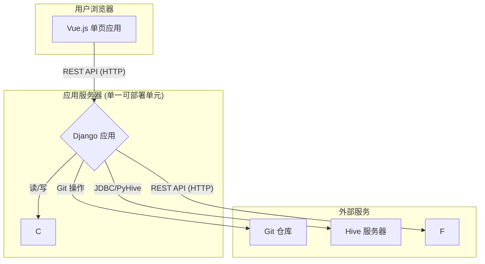

# 开发大纲：轻量级数据血缘工具
## 技术栈选型

| 组件       | 推荐技术                       | 理由                                                                                                                                                                                                     |
|------------|--------------------------------|----------------------------------------------------------------------------------------------------------------------------------------------------------------------------------------------------------|
| 后端框架   | Django & Django REST Framework | 一个为快速、实用开发而设计的高级Python框架。Django REST Framework是使用Django构建健壮Web API的行业标准，可以轻松地与Vue.js前端对接。                                                                          |
| 前端框架   | Vue.js 3                       | 一个现代化的、渐进式的JavaScript框架，它易于学习且功能强大，足以构建所需的交互式用户界面，包括SQL编辑器和图形可视化。                                                                                          |
| 数据库     | SQLite                         | 对于一个小型内部工具，SQLite是理想选择。它与Django配合使用无需任何配置，对于读密集型操作速度极快，并且将备份和部署简化为单个文件。如果未来并发或高级功能成为问题，迁移到PostgreSQL在Django中是一个有据可查的过程 |
| Git集成    | GitPython 库                   | 一个成熟的Python库，为与Git仓库交互提供了一个直观的对象模型，非常适合克隆、读取文件和提交更改                                                                                                                 |
| HTTP客户端 | Requests 库                    | Python中进行HTTP请求的事实标准。它将用于与您现有的SQL解析服务通信                                                                                                                                         |
| SQL编辑器  | Monaco Editor                  | 驱动VS Code的代码编辑器。它提供出色的SQL语言支持、语法高亮和丰富的API以实现自定义功能（如自动补全）。可以轻松集成到Vue中。                                                                                     |
| 图可视化   | AntV G6                        | 一个强大而灵活的图可视化引擎，与Vue配合良好。它非常适合渲染数据血缘和影响分析图                                                                                                                             |

---

## 系统架构
架构将采用经典且稳健的两层客户端-服务器模型：

1. 后端 (Django): 一个单体的Django应用，负责暴露一系列RESTful API端点。它将处理所有业务逻辑，包括：
    * 与Hive Metastore交互。
    * 管理Git仓库配置和操作。
    * 调用外部的SQL解析服务。
    * 将所有元数据和血缘数据持久化到本地SQLite数据库。
    * 提供前端应用的访问服务。

1. 前端 (Vue.js): 一个在用户浏览器中运行的单页应用 (SPA)。它将通过REST API与Django后端通信以获取数据和触发操作，并负责所有用户界面的渲染和交互。

---
## 详细开发大纲
项目将通过逻辑化的Django app进行结构划分，以实现清晰的关注点分离。

1. 模块 1: 项目核心与API设置
    * 目标: 初始化Django项目并配置REST框架。
    
    * 关键步骤:
        1. 创建一个新的Django项目和一个用于配置的core应用。
        2. 配置settings.py以使用默认的SQLite数据库引擎。
        3. 安装djangorestframework并将其添加到INSTALLED_APPS中。
        4. 在urls.py中设置基本的URL结构，用于路由API请求。

1. 模块 2: 元数据管理 (metadata 应用)
    * 目标: 爬取并本地存储Hive元数据。
    
    * 组件:
        * 模型 (models.py):
            * HiveTable(name, db, columns_json): 存储表和列的信息。
            * BusinessMapping(table, application_name, module_name): 将表映射到业务概念。
        
        * 服务 (hive_crawler.py):
            * 一个使用PyHive通过Kerberos连接到您的Hive服务器的类。
            * 它将执行SHOW TABLES, DESCRIBE \<table\>等命令来收集元数据。
        * 管理命令 (management/commands/crawl_metadata.py):
            * 一个python manage.py crawl_metadata命令，用于运行爬虫并将最新的元数据填充到SQLite数据库中。此命令可以手动运行，也可以通过cron进行定时调度。

3. 模块 3: Git集成与用户配置 (git 应用)
    * 目标: 管理Git仓库连接和用户特定的设置。
    * 组件:
        * 模型 (models.py):
            GitRepo(user, repo_url, local_path, username, password): 一个与Django内置User模型关联的模型，用于存储仓库配置。密码应被加密存储。
        
        * 认证:
        使用Django内置的User模型和认证系统。
            创建一个受SessionAuthentication或TokenAuthentication保护的API端点POST /api/git/config/。这允许已认证的用户配置他们的Git凭据。应用的其他部分将按要求保持开放。
        
        * 服务 (git_service.py):
            一个使用GitPython的服务类，用于处理如clone、pull、读取文件内容以及列出仓库中所有.sql文件等操作。

4. 模块 4: 血缘引擎 (lineage 应用)
    * 目标: 通过调用外部API并存储结果来编排血缘分析。

    * 组件:
        * 模型 (models.py):
          *  LineageRelation(source_table, target_table, sql_script_path): 一个简单的模型，用于存储两个表之间的有向关系。外键将链接到HiveTable模型。
        
        * 服务 (lineage_service.py):
          * 一个接受SQL字符串作为输入的服务。
          * 它将使用requests库，向您的http://localhost:9600/sqlflow/datalineage 端点发送一个带有正确JSON负载的POST请求。
          * 它将处理返回的JSON响应，识别源表和目标表，并将它们作为LineageRelation对象保存在数据库中。
        
        * API视图 (views.py):
          * POST /api/lineage/parse-sql/: 用于解析请求体中提供的单个SQL语句的端点。
            
          * POST /api/lineage/parse-repo/{repo_id}/: 触发批量分析的端点。它将使用GitService遍历已配置仓库中的所有SQL文件，将每个文件发送到LineageService进行解析，并存储所有结果。
            
          * GET /api/lineage/impact/{table_name}/: 用于影响分析的端点。它将查询LineageRelation模型以查找给定表的所有下游依赖。

5. 模块 5: 前端应用 (Vue.js)
    * 目标: 创建用户界面。
    * 关键视图/组件:
        1. SQL编辑器视图:
        
            * 使用create-vue初始化项目。
            
            * 使用如@guolao/vue-monaco-editor之类的包装器集成Monaco Editor。
            
            * SQL自动补全:
            
              * 当用户在Monaco编辑器中输入时，将当前文本和光标位置发送到一个新的后端API端点 (GET /api/editor/autocomplete/)。
                
              * 该后端端点将查询SQLite中的本地HiveTable元数据，并返回匹配的表名和列名列表。
                
              * Vue组件将向用户显示这些建议。
        
        2. 血缘可视化视图:
           * 集成AntV G6。
           * 创建一个组件，调用/api/lineage/impact/\{table_name\}/端点。
           * 它将接收一个节点（表）和边（依赖关系）的列表，并将其渲染为可交互的图。
        
        3. 配置视图:
            * 一个简单的表单，供用户登录（如果Git配置需要）和管理他们的Git仓库设置。
        4. 仪表盘/浏览器视图:
            * 一个用于浏览已爬取的Hive元数据，并对已配置的仓库触**发批量分析作业的视图。