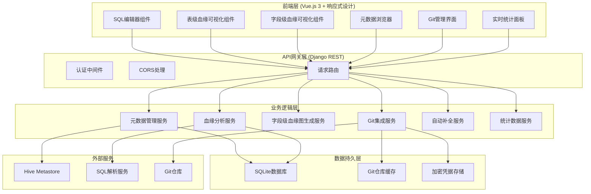
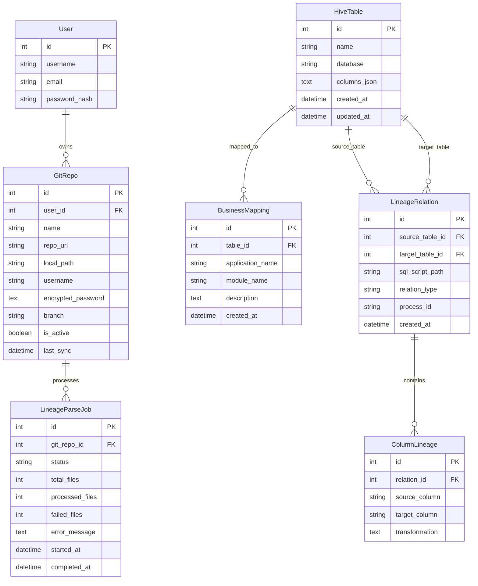
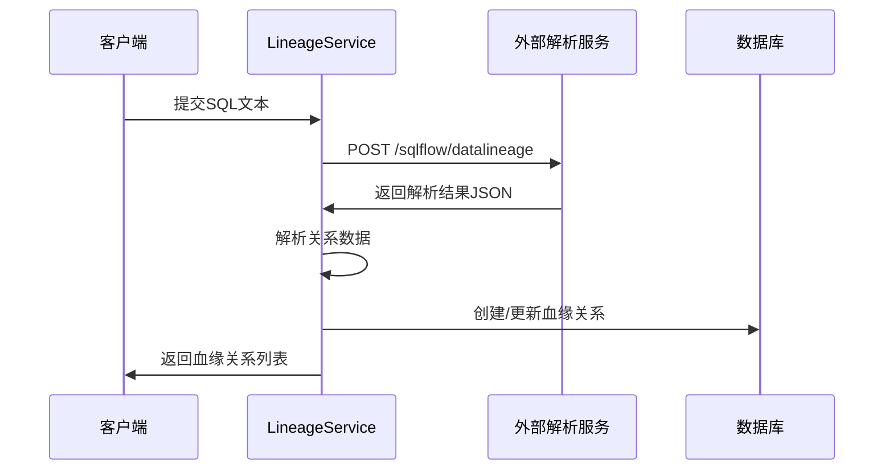
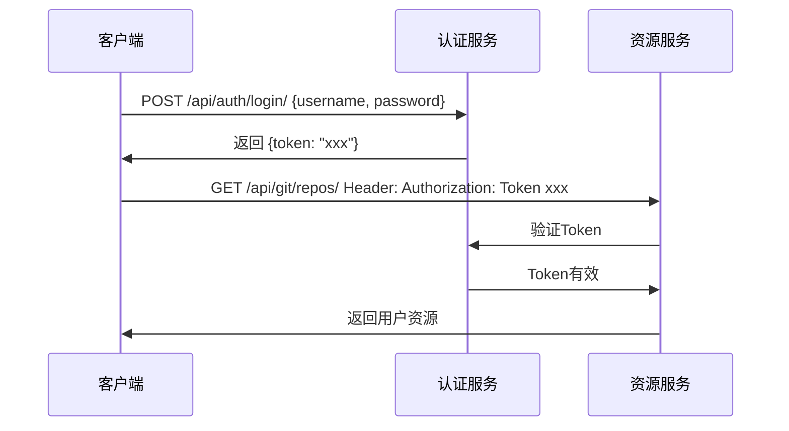

# HiicHiveIDE 项目开发逻辑详细说明

## 文档目的

本文档详细说明 HiicHiveIDE 项目的开发逻辑、数据流、API 设计和核心算法，帮助 AI 助手更好地理解整个项目的架构和实现细节。

## 系统架构深度解析

### 1. 整体架构概览



### 2. 数据模型关系图



## 核心业务逻辑详解

### 1. 元数据管理模块 (apps_metadata)

#### 1.1 Hive 元数据爬取流程

```python
class HiveCrawler:
    def crawl_metadata(self):
        """
        爬取流程：
        1. 建立 Kerberos 认证的 Hive 连接
        2. 执行 SHOW DATABASES 获取数据库列表
        3. 对每个数据库执行 SHOW TABLES 获取表列表
        4. 对每个表执行 DESCRIBE 获取列信息
        5. 将数据持久化到 SQLite
        """
```

**数据流：**
```
Hive Metastore → PyHive连接 → SHOW命令 → 数据解析 → SQLite存储
```

**关键算法：**
- 使用 Kerberos 认证建立安全连接
- 递归遍历数据库和表结构
- JSON 序列化列信息存储
- 增量更新机制（update_or_create）

#### 1.2 统计数据服务逻辑

```python
@action(detail=False, methods=['get'])
def statistics(self, request):
    """
    实时统计数据生成：
    1. 计算数据库数量 - HiveTable.objects.values('database').distinct().count()
    2. 计算表数量 - HiveTable.objects.count()
    3. 计算字段数量 - 遍历所有表的columns_json统计
    4. 计算血缘关系数量 - LineageRelation.objects.count()
    """
    database_count = HiveTable.objects.values('database').distinct().count()
    table_count = HiveTable.objects.count()
    
    column_count = 0
    for table in HiveTable.objects.all():
        column_count += len(table.columns)
    
    lineage_count = LineageRelation.objects.count()
    
    return Response({
        'database_count': database_count,
        'table_count': table_count, 
        'column_count': column_count,
        'lineage_count': lineage_count
    })
```

**首页实时统计展示流程：**
```
Vue组件挂载 → 调用metadataAPI.getStatistics() → 后端计算实时数据 → 前端更新UI展示
```

#### 1.3 自动补全服务逻辑

```python
def autocomplete(query, limit):
    """
    自动补全算法：
    1. 模糊匹配表名和数据库名
    2. 遍历匹配的表，检查列名匹配
    3. 按相关度排序返回结果
    4. 限制返回数量避免性能问题
    """
    # 表级匹配
    tables = HiveTable.objects.filter(
        Q(name__icontains=query) | Q(database__icontains=query)
    )
    
    # 列级匹配
    for table in tables:
        for column in table.columns:
            if query.lower() in column['name'].lower():
                # 添加到建议列表
```

### 2. 血缘分析模块 (apps_lineage)

#### 2.1 SQL 解析和血缘提取流程



**关键数据结构解析：**

外部服务返回的 JSON 结构：
```json
{
  "code": 200,
  "data": {
    "sqlflow": {
      "relationships": [
        {
          "id": "1",
          "type": "fdd",
          "effectType": "insert",
          "target": {
            "id": "5",
            "column": "`bk_investment_event_id`",
            "parentName": "dwt_capital.dim_investment_event_df"
          },
          "sources": [
            {
              "id": "24",
              "column": "logic_id",
              "parentName": "dwd_zbk.dwd_zbk_investor_project_information"
            }
          ]
        }
      ]
    }
  }
}
```

**血缘关系提取算法：**
```python
def extract_lineage_relations(parsed_data, sql_script_path):
    relations = []
    relationships = parsed_data.get('sqlflow', {}).get('relationships', [])
    
    for relationship in relationships:
        # 1. 解析目标表信息
        target = relationship.get('target', {})
        target_parent_name = target.get('parentName', '')
        target_db, target_table = target_parent_name.split('.', 1)
        
        # 2. 获取或创建目标表对象
        target_hive_table = HiveTable.objects.get_or_create(...)
        
        # 3. 处理源表
        for source in relationship.get('sources', []):
            source_parent_name = source.get('parentName', '')
            source_db, source_table = source_parent_name.split('.', 1)
            
            # 4. 创建血缘关系
            relation = LineageRelation.objects.get_or_create(
                source_table=source_hive_table,
                target_table=target_hive_table,
                sql_script_path=sql_script_path,
                defaults={
                    'relation_type': relationship.get('effectType'),
                    'process_id': relationship.get('processId')
                }
            )
            
            # 5. 创建列级血缘
            ColumnLineage.objects.get_or_create(
                relation=relation,
                source_column=source.get('column'),
                target_column=target.get('column')
            )
```

#### 2.2 字段级血缘图生成算法

```python
def get_column_lineage_graph(self, parsed_data):
    """
    字段级血缘图数据结构生成：
    1. 从SQLFlow响应中解析表和字段信息
    2. 分离源表和目标表
    3. 生成字段级关系映射
    4. 返回结构化数据供前端渲染
    """
    tables_info = {}
    column_relationships = []
    
    relationships = sqlflow_data.get('relationships', [])
    
    for relationship in relationships:
        # 处理目标表和字段
        target_table_name = target.get('parentName', '')
        target_column = target.get('column', '').strip('`')
        
        # 处理源表和字段  
        for source in sources:
            source_table_name = source.get('parentName', '')
            source_column = source.get('column', '').strip('`')
            
            # 收集表信息
            if source_table_name not in tables_info:
                tables_info[source_table_name] = {
                    'name': source_table_name,
                    'type': 'source',
                    'columns': set()
                }
            tables_info[source_table_name]['columns'].add(source_column)
            
            # 添加字段级关系
            column_relationships.append({
                'source_table': source_table_name,
                'source_column': source_column,
                'target_table': target_table_name,
                'target_column': target_column,
                'relation_type': relationship.get('effectType', 'insert')
            })
    
    return {
        'tables': [转换为列表格式],
        'relationships': column_relationships
    }
```

**字段级血缘图数据流：**
```
SQLFlow原始响应 → get_column_lineage_graph() → 结构化图数据 → ColumnLineageGraph.vue → SVG渲染
```

#### 2.3 影响分析算法

```python
def get_downstream_impact(table_name):
    """
    影响分析使用深度优先搜索算法：
    1. 从指定表开始作为根节点
    2. 查找所有以该表为源的血缘关系
    3. 递归遍历下游表，避免循环依赖
    4. 返回完整的影响范围
    """
    downstream_tables = set()
    visited = set()
    
    def traverse_downstream(current_table):
        if current_table.id in visited:
            return  # 避免循环依赖
        visited.add(current_table.id)
        
        relations = LineageRelation.objects.filter(
            source_table=current_table
        ).select_related('target_table')
        
        for relation in relations:
            downstream_tables.add(relation.target_table)
            traverse_downstream(relation.target_table)
```

### 3. Git 集成模块 (apps_git)

#### 3.1 Git 仓库管理流程

**凭据加密存储：**
```python
class GitRepo(models.Model):
    encrypted_password = models.TextField()
    
    def set_password(self, password):
        f = Fernet(self._get_encryption_key())
        self.encrypted_password = f.encrypt(password.encode()).decode()
    
    def get_password(self):
        f = Fernet(self._get_encryption_key())
        return f.decrypt(self.encrypted_password.encode()).decode()
```

**Git 操作服务：**
```python
class GitService:
    def clone_or_pull(self):
        """
        仓库同步逻辑：
        1. 检查本地路径是否存在
        2. 如果不存在，执行 git clone
        3. 如果存在，执行 git pull
        4. 使用用户提供的凭据进行认证
        """
        if not os.path.exists(self.repo.repo_local_path):
            # Clone repository
            git.Repo.clone_from(
                url=f"https://{username}:{password}@{repo_url}",
                to_path=self.repo.repo_local_path,
                branch=self.repo.branch
            )
        else:
            # Pull updates
            repo = git.Repo(self.repo.repo_local_path)
            repo.remote().pull()
```

#### 3.2 SQL 文件发现和处理

```python
def get_sql_files(self):
    """
    SQL 文件发现算法：
    1. 递归遍历仓库目录
    2. 过滤 .sql 文件
    3. 提取文件元信息（大小、修改时间等）
    4. 返回文件列表供批量处理
    """
    sql_files = []
    for root, dirs, files in os.walk(self.repo.repo_local_path):
        for file in files:
            if file.endswith('.sql'):
                file_path = os.path.join(root, file)
                rel_path = os.path.relpath(file_path, self.repo.repo_local_path)
                
                stat = os.stat(file_path)
                sql_files.append({
                    'path': rel_path,
                    'full_path': file_path,
                    'size': stat.st_size,
                    'modified': stat.st_mtime
                })
    
    return sql_files
```

### 4. 前端组件设计逻辑

#### 4.1 SQL 编辑器组件 (SQLEditor.vue)

**集成血缘图展示功能：**
```javascript
// 解析成功后自动显示血缘图
const parseSql = async () => {
    const response = await lineageAPI.parseSQL(sqlCode.value)
    parseResult.value = response.data
    
    if (response.data.status === 'success') {
        // 如果有血缘图数据，自动显示血缘图
        if (response.data.column_graph && response.data.column_graph.tables && response.data.column_graph.tables.length > 0) {
            showLineageDetail.value = true
        }
    }
}

// 检查是否有血缘图数据可以展示
const showLineageGraph = computed(() => {
    return parseResult.value && 
           parseResult.value.status === 'success' && 
           parseResult.value.column_graph && 
           parseResult.value.column_graph.tables && 
           parseResult.value.column_graph.tables.length > 0
})

// 切换血缘图显示
const toggleLineageView = () => {
    showLineageDetail.value = !showLineageDetail.value
}
```

**模板集成：**
```vue
<template>
  <div class="parse-result">
    <div class="result-header">
      <h4>解析结果</h4>
      <div class="result-actions">
        <el-tag type="success">找到 {{ parseResult.relations_count }} 个血缘关系</el-tag>
        <el-button @click="toggleLineageView">
          {{ showLineageDetail ? '隐藏血缘图' : '显示血缘图' }}
        </el-button>
      </div>
    </div>
    
    <!-- 集成的血缘图展示区域 -->
    <div v-if="showLineageDetail" class="lineage-display">
      <ColumnLineageGraph 
        :column-graph="parseResult.column_graph" 
        :loading="false" 
        :error="''" 
      />
    </div>
  </div>
</template>
```

**Monaco Editor 集成：**
```javascript
// 自动补全提供者注册
monaco.languages.registerCompletionItemProvider('sql', {
    provideCompletionItems: async (model, position) => {
        const word = model.getWordUntilPosition(position)
        
        // 调用后端自动补全API
        const response = await metadataAPI.getAutocomplete(word.word, 20)
        
        // 转换为Monaco格式的建议
        const suggestions = response.data.map(item => ({
            label: item.label,
            kind: item.type === 'table' 
                ? monaco.languages.CompletionItemKind.Class 
                : monaco.languages.CompletionItemKind.Field,
            insertText: item.value,
            detail: item.dataType || item.database,
            range: range,
        }))
        
        return { suggestions }
    }
})
```

#### 4.2 字段级血缘可视化组件 (ColumnLineageGraph.vue)

**SVG 渲染引擎设计：**
```javascript
const renderColumnGraph = () => {
    // 1. 创建SVG容器
    const svg = document.createElementNS('http://www.w3.org/2000/svg', 'svg')
    svg.setAttribute('viewBox', `0 0 ${containerWidth} ${containerHeight}`)
    
    // 2. 分离源表和目标表
    const sourceTables = columnGraph.tables.filter(t => t.type === 'source')
    const targetTables = columnGraph.tables.filter(t => t.type === 'target')
    
    // 3. 计算布局参数
    const tableWidth = 250
    const columnHeight = 25
    const leftColumnX = 50
    const rightColumnX = containerWidth - tableWidth - 50
    
    // 4. 渲染表格结构
    sourceTables.forEach((table, index) => {
        const y = 50 + index * (tableHeight + 30)
        renderTable(table, leftColumnX, y, 'source')
    })
    
    // 5. 渲染连线
    columnGraph.relationships.forEach((rel) => {
        const sourceY = calculateFieldPosition(rel.source_table, rel.source_column)
        const targetY = calculateFieldPosition(rel.target_table, rel.target_column)
        
        // 贝塞尔曲线连接
        const path = `M ${sourceX} ${sourceY} C ${midX} ${sourceY}, ${midX} ${targetY}, ${targetX} ${targetY}`
        createSVGPath(path)
    })
}
```

**表名智能处理：**
```javascript
// 表名处理函数 - 解决长表名溢出问题
const getDisplayTableName = (fullName: string, maxWidth: number) => {
    // 先尝试只显示表名（去掉库名）
    const parts = fullName.split('.')
    const tableName = parts.length > 1 ? parts[parts.length - 1] : fullName
    
    // 如果表名仍然太长，进行省略
    if (tableName.length > 20) {
        return tableName.substring(0, 17) + '...'
    }
    
    return tableName
}

// 添加完整表名的tooltip
const tableNameTitle = document.createElementNS('http://www.w3.org/2000/svg', 'title')
tableNameTitle.textContent = table.name
tableName.appendChild(tableNameTitle)
```

**下载导出功能：**
```javascript
// PNG下载功能
const downloadPNG = () => {
    const svg = graphContainer.value?.querySelector('svg')
    const canvas = document.createElement('canvas')
    const ctx = canvas.getContext('2d')
    
    const svgData = new XMLSerializer().serializeToString(svg)
    const svgBlob = new Blob([svgData], { type: 'image/svg+xml;charset=utf-8' })
    const svgUrl = URL.createObjectURL(svgBlob)
    
    const img = new Image()
    img.onload = () => {
        canvas.width = img.width * 2  // 提高分辨率
        canvas.height = img.height * 2
        ctx.scale(2, 2)
        ctx.fillStyle = 'white'
        ctx.fillRect(0, 0, canvas.width, canvas.height)
        ctx.drawImage(img, 0, 0)
        
        // 下载
        const link = document.createElement('a')
        link.download = `字段血缘图_${new Date().getTime()}.png`
        link.href = canvas.toDataURL('image/png')
        link.click()
        
        URL.revokeObjectURL(svgUrl)
    }
    img.src = svgUrl
}

// SVG下载功能
const downloadSVG = () => {
    const svg = graphContainer.value?.querySelector('svg')
    const svgData = new XMLSerializer().serializeToString(svg)
    const svgBlob = new Blob([svgData], { type: 'image/svg+xml;charset=utf-8' })
    const svgUrl = URL.createObjectURL(svgBlob)
    
    const link = document.createElement('a')
    link.download = `字段血缘图_${new Date().getTime()}.svg`
    link.href = svgUrl
    link.click()
    
    URL.revokeObjectURL(svgUrl)
}
```

**交互功能实现：**
```javascript
// 字段高亮逻辑
const highlightColumn = (columnId) => {
    // 1. 高亮当前字段
    const columnBg = document.getElementById(`bg-${columnId}`)
    columnBg.setAttribute('fill', '#e6f7ff')
    
    // 2. 查找相关连线
    const lines = document.querySelectorAll('.relationship-line')
    lines.forEach((line) => {
        const sourceColumn = line.getAttribute('data-source')
        const targetColumn = line.getAttribute('data-target')
        
        if (sourceColumn === columnId || targetColumn === columnId) {
            // 高亮连线
            line.setAttribute('stroke', '#ff7875')
            line.setAttribute('stroke-width', '3')
            
            // 高亮相关字段
            const relatedColumnId = sourceColumn === columnId ? targetColumn : sourceColumn
            highlightRelatedField(relatedColumnId)
        }
    })
}

// 鼠标事件绑定
columnBg.addEventListener('mouseenter', () => highlightColumn(columnId))
columnBg.addEventListener('mouseleave', () => clearHighlight())
```

**响应式布局适配：**
```javascript
// 不同屏幕尺寸的布局调整
const calculateLayout = () => {
    const screenWidth = window.innerWidth
    
    if (screenWidth < 768) {
        // 移动端：垂直布局
        return {
            tableWidth: screenWidth * 0.8,
            layout: 'vertical'
        }
    } else {
        // 桌面端：水平布局
        return {
            tableWidth: 250,
            layout: 'horizontal'
        }
    }
}
```

#### 4.3 表级血缘可视化组件 (LineageGraph.vue)

**G6 图渲染逻辑：**
```javascript
// 图数据转换
const transformGraphData = (apiData) => {
    const nodes = apiData.nodes.map(node => ({
        id: node.id,
        label: node.label,
        type: 'table-node',
        style: {
            fill: node.id === centerTable ? '#1890ff' : '#f0f0f0'
        }
    }))
    
    const edges = apiData.edges.map(edge => ({
        source: edge.source,
        target: edge.target,
        label: edge.type,
        style: {
            stroke: getEdgeColor(edge.type)
        }
    }))
    
    return { nodes, edges }
}

// 图布局配置
const graph = new G6.Graph({
    layout: {
        type: 'dagre',
        direction: 'LR',
        nodeSpacing: 50,
        rankSpacing: 100
    },
    defaultNode: {
        type: 'rect',
        style: {
            radius: 5,
            stroke: '#666',
            lineWidth: 1
        }
    },
    defaultEdge: {
        type: 'polyline',
        style: {
            radius: 5,
            offset: 15,
            endArrow: true
        }
    }
})
```

## API 设计原则和模式

### 1. RESTful API 设计模式

**资源命名规范：**
```
GET    /api/metadata/tables/              # 获取表列表
POST   /api/metadata/tables/              # 创建表（通常通过爬虫）
GET    /api/metadata/tables/{id}/         # 获取特定表信息
PUT    /api/metadata/tables/{id}/         # 更新表信息
DELETE /api/metadata/tables/{id}/         # 删除表信息

# 嵌套资源
GET    /api/metadata/tables/{id}/columns/ # 获取表的列信息
```

**自定义动作模式：**
```
GET    /api/metadata/tables/databases/    # 获取数据库列表
GET    /api/metadata/tables/autocomplete/ # 自动补全
GET    /api/metadata/tables/statistics/   # 实时统计数据
POST   /api/lineage/parse-sql/            # 解析SQL（返回表级+字段级血缘）
POST   /api/git/repos/{id}/sync/          # 同步仓库
```

### 2. 统一响应格式

**成功响应：**
```json
{
    "status": "success",
    "data": {...},
    "meta": {
        "count": 100,
        "page": 1,
        "per_page": 20
    }
}
```

**parse-sql API 增强响应格式：**
```json
{
    "status": "success",
    "relations_count": 3,
    "relations": [
        {
            "source_table": {
                "full_name": "dwd_zbk.dwd_zbk_investor_project_information",
                "database": "dwd_zbk",
                "name": "dwd_zbk_investor_project_information"
            },
            "target_table": {
                "full_name": "dwt_capital.dim_investment_event_df",
                "database": "dwt_capital", 
                "name": "dim_investment_event_df"
            },
            "relation_type": "insert"
        }
    ],
    "column_graph": {
        "tables": [
            {
                "name": "dwd_zbk.dwd_zbk_investor_project_information",
                "type": "source",
                "columns": ["logic_id", "investment_event_name"]
            },
            {
                "name": "dwt_capital.dim_investment_event_df", 
                "type": "target",
                "columns": ["bk_investment_event_id", "sk_investment_event_id", "investment_event_name"]
            }
        ],
        "relationships": [
            {
                "source_table": "dwd_zbk.dwd_zbk_investor_project_information",
                "source_column": "logic_id",
                "target_table": "dwt_capital.dim_investment_event_df",
                "target_column": "bk_investment_event_id",
                "relation_type": "insert"
            }
        ]
    }
}
```

**统计数据API响应格式：**
```json
{
    "database_count": 5,
    "table_count": 128,
    "column_count": 1250,
    "lineage_count": 45
}
```

**错误响应：**
```json
{
    "status": "error",
    "message": "详细错误信息",
    "code": "ERROR_CODE",
    "details": {...}
}
```

### 3. 认证和权限控制

**Token 认证流程：**


## 性能优化策略

### 1. 数据库查询优化

**使用 select_related 减少查询次数：**
```python
# 避免 N+1 查询问题
queryset = LineageRelation.objects.select_related(
    'source_table', 'target_table'
).prefetch_related('column_lineages')
```

**索引优化：**
```python
class HiveTable(models.Model):
    name = models.CharField(max_length=255, db_index=True)
    database = models.CharField(max_length=255, db_index=True)
    
    class Meta:
        unique_together = ['name', 'database']  # 复合索引
```

### 2. 前端性能优化

**组件懒加载：**
```javascript
// 路由级别的代码分割
const LineageView = () => import('@/views/LineageView.vue')
const EditorView = () => import('@/views/EditorView.vue')
```

**虚拟滚动（大量数据）：**
```javascript
// 对于大量表数据的展示
import { VirtualList } from '@tanstack/vue-virtual'
```

### 3. 响应式设计实现

**全局CSS断点策略：**
```css
/* 响应式断点定义 */
@media (max-width: 768px) {
  /* 平板和手机端 */
  .lineage-graph {
    padding: 10px;
  }
  
  .card-header {
    flex-direction: column;
    align-items: stretch;
  }
  
  .search-controls {
    flex-direction: column;
    align-items: stretch;
  }
}

@media (max-width: 480px) {
  /* 小屏手机端 */
  .lineage-graph {
    padding: 5px;
  }
  
  .graph-canvas {
    height: 300px; /* 减少高度 */
  }
}

@media (max-width: 576px) {
  /* 超小屏幕 */
  :deep(.el-row .el-col) {
    width: 100% !important;
    flex: 0 0 100% !important;
    max-width: 100% !important;
  }
}
```

**移动端导航设计：**
```javascript
// App.vue 中的移动端导航实现
const isMobile = ref(false)
const drawerOpen = ref(false)

const checkScreenSize = () => {
  isMobile.value = window.innerWidth < 768
  if (!isMobile.value) {
    drawerOpen.value = false
  }
}

onMounted(() => {
  checkScreenSize()
  window.addEventListener('resize', checkScreenSize)
})

// 抽屉式菜单模板
<el-drawer
  v-model="drawerOpen"
  direction="ltr"
  size="80%"
  :show-close="false"
>
  <template #header>
    <span>导航菜单</span>
  </template>
  <NavMenu @menu-click="drawerOpen = false" />
</el-drawer>
```

**组件级响应式适配：**
```javascript
// LineageGraph.vue 中的响应式逻辑
const resizeGraph = () => {
  if (graph.value && graphContainer.value) {
    const width = graphContainer.value.clientWidth
    const height = window.innerWidth < 768 ? 400 : 600 // 移动端降低高度
    graph.value.changeSize(width, height)
  }
}

// ColumnLineageGraph.vue 中的响应式SVG
const renderResponsiveGraph = () => {
  const containerWidth = graphContainer.value.clientWidth || 1200
  const isMobile = containerWidth < 768
  
  const config = {
    tableWidth: isMobile ? containerWidth * 0.4 : 250,
    tableSpacing: isMobile ? 20 : 100,
    fontSize: isMobile ? 10 : 12
  }
  
  // 使用响应式配置渲染图形
}
```

## 错误处理和日志策略

### 1. 分层错误处理

**视图层：**
```python
@action(detail=False, methods=['post'])
def parse_sql(self, request):
    try:
        serializer = ParseSQLSerializer(data=request.data)
        if not serializer.is_valid():
            return Response(serializer.errors, status=400)
        
        # 业务逻辑
        result = lineage_service.parse_sql_file(sql_text, file_path)
        return Response({'status': 'success', 'data': result})
        
    except ValidationError as e:
        return Response({'error': str(e)}, status=400)
    except ExternalServiceError as e:
        logger.error(f"External service error: {e}")
        return Response({'error': 'Service temporarily unavailable'}, status=503)
    except Exception as e:
        logger.error(f"Unexpected error: {e}")
        return Response({'error': 'Internal server error'}, status=500)
```

**服务层：**
```python
class LineageService:
    def parse_sql(self, sql_text):
        try:
            response = self.session.post(self.config['url'], json=payload)
            response.raise_for_status()
            return response.json()
        except requests.exceptions.Timeout:
            raise ExternalServiceError("SQL parsing service timeout")
        except requests.exceptions.ConnectionError:
            raise ExternalServiceError("Cannot connect to SQL parsing service")
```

### 2. 日志记录策略

**配置不同级别的日志：**
```python
LOGGING = {
    'version': 1,
    'handlers': {
        'file': {
            'level': 'INFO',
            'class': 'logging.FileHandler',
            'filename': 'logs/hive_ide.log',
        },
        'console': {
            'level': 'DEBUG',
            'class': 'logging.StreamHandler',
        }
    },
    'loggers': {
        'apps_lineage': {
            'handlers': ['file', 'console'],
            'level': 'DEBUG',
        },
        'apps_metadata': {
            'handlers': ['file', 'console'], 
            'level': 'INFO',
        }
    }
}
```

## 安全性考虑

### 1. 数据加密

**Git 凭据加密：**
```python
from cryptography.fernet import Fernet

class GitRepo(models.Model):
    def set_password(self, password):
        f = Fernet(settings.GIT_ENCRYPTION_KEY.encode())
        self.encrypted_password = f.encrypt(password.encode()).decode()
```

### 2. SQL 注入防护

**使用参数化查询：**
```python
# 正确方式
cursor.execute("SELECT * FROM tables WHERE database = %s", [database])

# 避免字符串拼接
# cursor.execute(f"SELECT * FROM tables WHERE database = '{database}'")  # 危险！
```

### 3. CSRF 保护

**Django 内置 CSRF 保护：**
```python
MIDDLEWARE = [
    'django.middleware.csrf.CsrfViewMiddleware',  # CSRF 保护
]

# API 使用 Token 认证时可以豁免
from django.views.decorators.csrf import csrf_exempt
```

## 部署和监控

### 1. 生产环境配置

**环境变量配置：**
```python
import os
from django.core.exceptions import ImproperlyConfigured

def get_env_variable(var_name):
    try:
        return os.environ[var_name]
    except KeyError:
        error_msg = f"Set the {var_name} environment variable"
        raise ImproperlyConfigured(error_msg)

# 生产环境设置
if os.environ.get('ENVIRONMENT') == 'production':
    DEBUG = False
    SECRET_KEY = get_env_variable('SECRET_KEY')
    HIVE_CONFIG['host'] = get_env_variable('HIVE_HOST')
```

### 2. 健康检查和监控

**健康检查端点：**
```python
@api_view(['GET'])
def health_check(request):
    checks = {
        'database': check_database_connection(),
        'hive': check_hive_connection(),
        'sqlflow_service': check_sqlflow_service(),
    }
    
    all_healthy = all(checks.values())
    status_code = 200 if all_healthy else 503
    
    return Response({
        'status': 'healthy' if all_healthy else 'unhealthy',
        'checks': checks,
        'timestamp': timezone.now()
    }, status=status_code)
```

## 扩展性设计

### 1. 插件化架构

**血缘解析器接口：**
```python
from abc import ABC, abstractmethod

class LineageParser(ABC):
    @abstractmethod
    def parse_sql(self, sql_text: str) -> dict:
        pass

class SQLFlowParser(LineageParser):
    def parse_sql(self, sql_text: str) -> dict:
        # 当前的 SQLFlow 实现
        pass

class CustomParser(LineageParser):
    def parse_sql(self, sql_text: str) -> dict:
        # 自定义解析器实现
        pass
```

### 2. 配置化支持

**多数据源支持：**
```python
DATASOURCE_CONFIGS = {
    'hive_prod': {
        'type': 'hive',
        'host': 'prod-hive.company.com',
        'port': 10000,
        'auth': 'KERBEROS'
    },
    'hive_test': {
        'type': 'hive', 
        'host': 'test-hive.company.com',
        'port': 10000,
        'auth': 'NONE'
    }
}
```

这个详细的开发逻辑说明文档涵盖了 HiicHiveIDE 项目的核心架构、算法实现、API 设计和最佳实践，为 AI 助手提供了深入理解项目的完整信息。