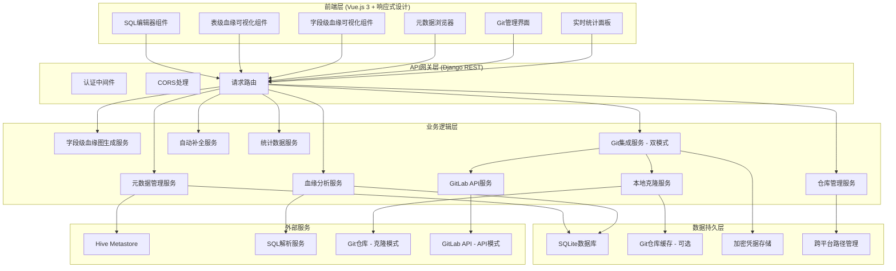
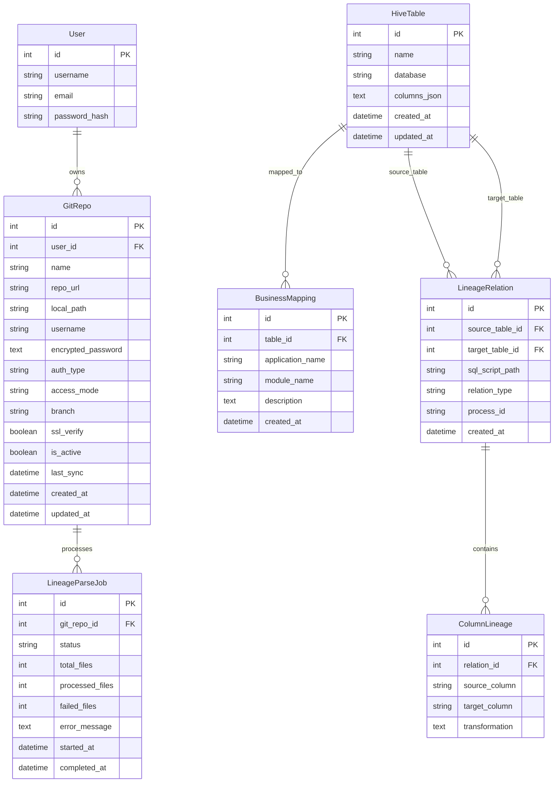
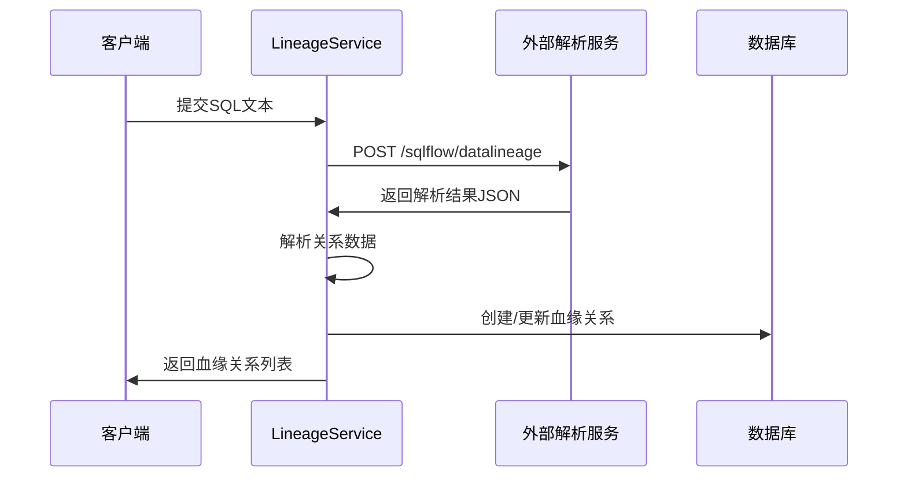
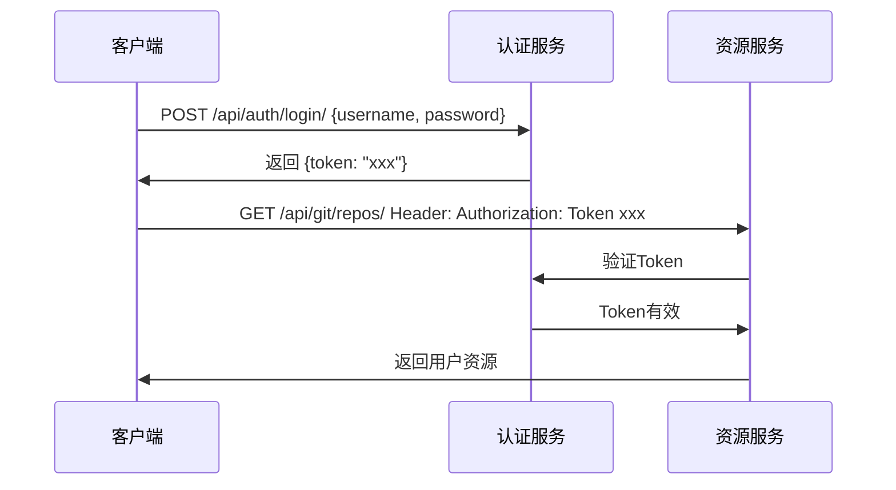
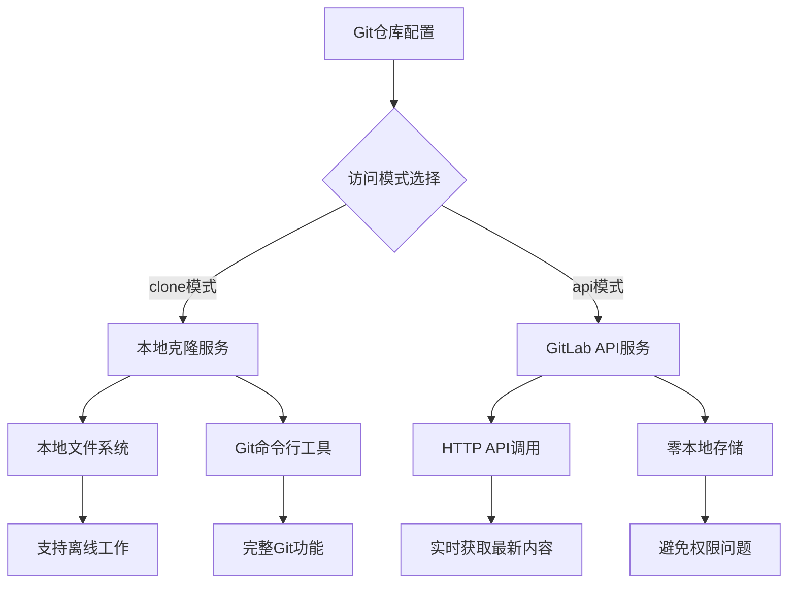
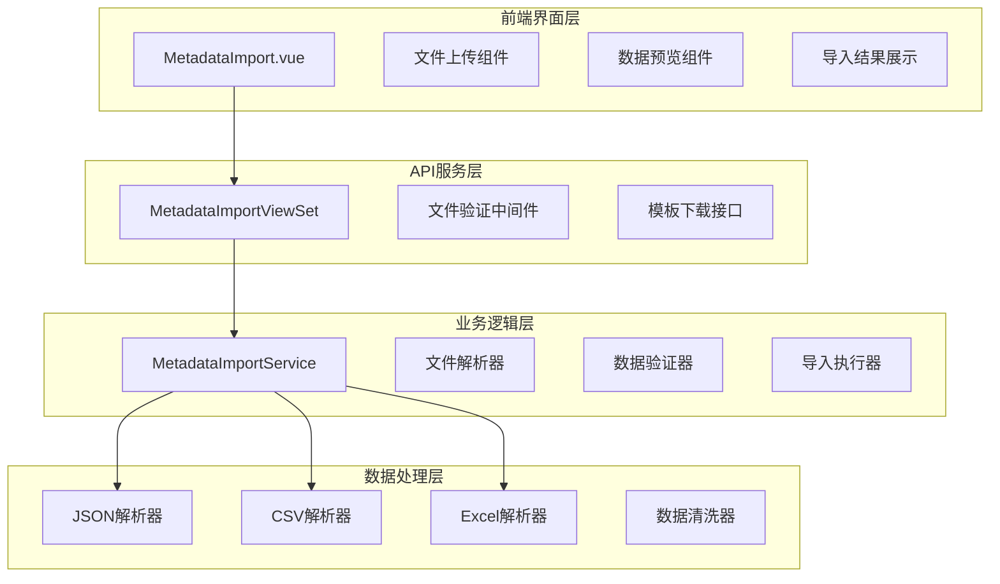
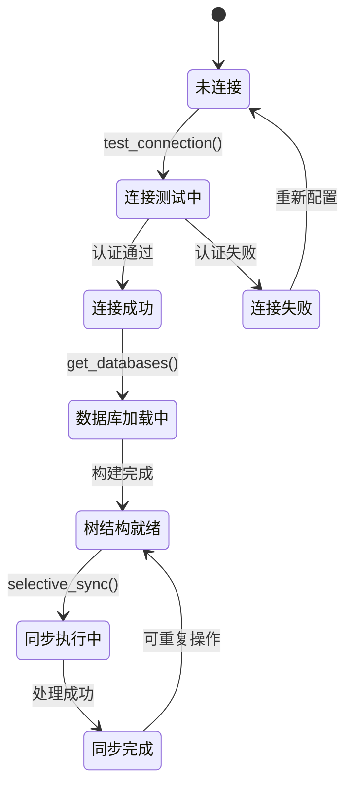

# HiicHiveIDE 项目开发逻辑详细说明

## 文档目的

本文档详细说明 HiicHiveIDE 项目的开发逻辑、数据流、API 设计和核心算法，帮助 AI 助手更好地理解整个项目的架构和实现细节。

## 最新更新 (2025-07-13)

### 新增完成的核心功能
1. **元数据删除管理系统** - 全部清空、指定删除数据库/表及相关血缘关系，级联删除机制
2. **深色模式配色优化** - 基于WCAG 2.1标准重新设计，提升可读性和视觉舒适度
3. **模板下载功能修复** - 修复CSV和Excel模板下载网络错误，优化文件编码处理
4. **Hive Kerberos认证增强** - 支持keytab文件、krb5.conf配置和自定义JAR包上传管理

### 已完成的高优先级功能 (2025-07-12)
1. **数据库初始化优化** - 自动检测数据库文件存在性并执行迁移
2. **SQLFlow服务集成** - 自动启动本地SQLFlow引擎，端口改为19600
3. **GitLab集成增强** - 支持内网私有GitLab，SSL证书验证可选，Token认证
4. **血缘图交互增强** - 全屏模式、重置视角、双击复制、完整表名显示
5. **Git认证和分支管理** - Token认证、Windows凭据管理、智能分支选择
6. **Git仓库状态恢复** - HEAD引用修复、损坏仓库自动恢复
7. **双模式Git访问** - 本地克隆模式 + API访问模式，适配不同部署环境
8. **Windows环境优化** - 完美解决路径权限问题，支持Windows服务器部署
9. **仓库管理增强** - 一键删除仓库和本地文件，智能清理机制

## 系统架构深度解析

### 1. 整体架构概览



### 2. 数据模型关系图



## 核心业务逻辑详解

### 1. 元数据管理模块 (apps_metadata)

#### 1.1 Hive 元数据爬取流程

```python
class HiveCrawler:
    def crawl_metadata(self):
        """
        爬取流程：
        1. 建立 Kerberos 认证的 Hive 连接
        2. 执行 SHOW DATABASES 获取数据库列表
        3. 对每个数据库执行 SHOW TABLES 获取表列表
        4. 对每个表执行 DESCRIBE 获取列信息
        5. 将数据持久化到 SQLite
        """
```

**数据流：**
```
Hive Metastore → PyHive连接 → SHOW命令 → 数据解析 → SQLite存储
```

**关键算法：**
- 使用 Kerberos 认证建立安全连接
- 递归遍历数据库和表结构
- JSON 序列化列信息存储
- 增量更新机制（update_or_create）

#### 1.2 统计数据服务逻辑

```python
@action(detail=False, methods=['get'])
def statistics(self, request):
    """
    实时统计数据生成：
    1. 计算数据库数量 - HiveTable.objects.values('database').distinct().count()
    2. 计算表数量 - HiveTable.objects.count()
    3. 计算字段数量 - 遍历所有表的columns_json统计
    4. 计算血缘关系数量 - LineageRelation.objects.count()
    """
    database_count = HiveTable.objects.values('database').distinct().count()
    table_count = HiveTable.objects.count()
    
    column_count = 0
    for table in HiveTable.objects.all():
        column_count += len(table.columns)
    
    lineage_count = LineageRelation.objects.count()
    
    return Response({
        'database_count': database_count,
        'table_count': table_count, 
        'column_count': column_count,
        'lineage_count': lineage_count
    })
```

**首页实时统计展示流程：**
```
Vue组件挂载 → 调用metadataAPI.getStatistics() → 后端计算实时数据 → 前端更新UI展示
```

#### 1.3 自动补全服务逻辑

```python
def autocomplete(query, limit):
    """
    自动补全算法：
    1. 模糊匹配表名和数据库名
    2. 遍历匹配的表，检查列名匹配
    3. 按相关度排序返回结果
    4. 限制返回数量避免性能问题
    """
    # 表级匹配
    tables = HiveTable.objects.filter(
        Q(name__icontains=query) | Q(database__icontains=query)
    )
    
    # 列级匹配
    for table in tables:
        for column in table.columns:
            if query.lower() in column['name'].lower():
                # 添加到建议列表
```

#### 1.4 元数据删除管理系统 (2025-07-13 新增)

**功能架构**:
```python
@action(detail=False, methods=['delete'])
def clear_all(self, request):
    """全部清空元数据和血缘关系"""
    # 统计删除前的数据
    stats_before = self._get_deletion_stats()
    
    # 使用事务确保数据一致性
    from django.db import transaction
    with transaction.atomic():
        # 1. 删除所有血缘关系（级联删除ColumnLineage）
        from apps_lineage.models import LineageRelation
        lineage_deleted = LineageRelation.objects.all().delete()
        
        # 2. 删除所有业务映射
        business_deleted = BusinessMapping.objects.all().delete()
        
        # 3. 删除所有表记录
        tables_deleted = HiveTable.objects.all().delete()
    
    return Response({
        'message': '所有元数据和血缘关系已清空',
        'deleted_counts': {
            'tables': tables_deleted[0],
            'business_mappings': business_deleted[0], 
            'lineage_relations': lineage_deleted[0]
        }
    })
```

**指定数据库删除逻辑**:
```python
@action(detail=False, methods=['delete'])
def delete_database(self, request):
    """删除指定数据库的所有表和相关血缘"""
    database = request.query_params.get('database')
    if not database:
        return Response({'error': '缺少database参数'}, status=400)
    
    # 获取该数据库的所有表
    tables = HiveTable.objects.filter(database=database)
    if not tables.exists():
        return Response({'error': f'数据库 {database} 不存在'}, status=404)
    
    with transaction.atomic():
        # 级联删除相关血缘关系
        table_ids = list(tables.values_list('id', flat=True))
        lineage_deleted = LineageRelation.objects.filter(
            Q(source_table_id__in=table_ids) | Q(target_table_id__in=table_ids)
        ).delete()
        
        # 删除业务映射
        business_deleted = BusinessMapping.objects.filter(table__in=tables).delete()
        
        # 删除表记录
        tables_deleted = tables.delete()
```

**级联删除机制**:
- **HiveTable删除** → 自动删除BusinessMapping（外键CASCADE）
- **HiveTable删除** → 自动删除LineageRelation（作为source或target）
- **LineageRelation删除** → 自动删除ColumnLineage（外键CASCADE）

#### 1.5 Hive Kerberos认证增强系统 (2025-07-13 新增)

**数据模型设计**:
```python
class HiveAuthConfig(models.Model):
    """Hive认证配置模型"""
    user = models.ForeignKey(User, on_delete=models.CASCADE)
    name = models.CharField(max_length=255)  # 配置名称
    host = models.CharField(max_length=255)
    port = models.IntegerField(default=10000)
    auth_type = models.CharField(choices=[
        ('NONE', '无认证'),
        ('LDAP', 'LDAP认证'), 
        ('KERBEROS', 'Kerberos认证')
    ])
    
    # Kerberos认证字段
    principal = models.CharField(max_length=255, blank=True)
    keytab_file = models.FileField(upload_to=hive_auth_file_upload_path)
    krb5_conf_file = models.FileField(upload_to=hive_auth_file_upload_path)
    
    # 自定义JAR包支持
    custom_jar_files = models.TextField(blank=True)  # JSON格式存储文件路径列表
```

**文件上传路径隔离**:
```python
def hive_auth_file_upload_path(instance, filename):
    """用户隔离的文件上传路径"""
    return f"hive_auth/{instance.user.id}/{filename}"
```

**JAR包管理模型**:
```python
class HiveJarFile(models.Model):
    """自定义JAR包文件管理"""
    user = models.ForeignKey(User, on_delete=models.CASCADE)
    name = models.CharField(max_length=255)  # 显示名称
    file = models.FileField(upload_to=hive_auth_file_upload_path)
    description = models.TextField(blank=True)
    version = models.CharField(max_length=50, blank=True)
    is_active = models.BooleanField(default=True)
```

**认证配置API设计**:
```python
class HiveAuthConfigViewSet(viewsets.ModelViewSet):
    """Hive认证配置管理视图"""
    serializer_class = HiveAuthConfigSerializer
    permission_classes = [IsAuthenticated]
    
    def get_queryset(self):
        # 用户只能访问自己的配置
        return HiveAuthConfig.objects.filter(user=self.request.user)
    
    @action(detail=True, methods=['post'])
    def test_connection(self, request, pk=None):
        """测试认证配置连接"""
        auth_config = self.get_object()
        try:
            # 使用配置测试Hive连接
            connection = self._create_hive_connection(auth_config)
            cursor = connection.cursor()
            cursor.execute("SHOW DATABASES LIMIT 1")
            return Response({'status': 'success', 'message': '连接测试成功'})
        except Exception as e:
            return Response({'status': 'error', 'message': str(e)}, status=400)
```

### 2. 血缘分析模块 (apps_lineage)

#### 2.1 SQL 解析和血缘提取流程



**关键数据结构解析：**

外部服务返回的 JSON 结构：
```json
{
  "code": 200,
  "data": {
    "sqlflow": {
      "relationships": [
        {
          "id": "1",
          "type": "fdd",
          "effectType": "insert",
          "target": {
            "id": "5",
            "column": "`bk_investment_event_id`",
            "parentName": "dwt_capital.dim_investment_event_df"
          },
          "sources": [
            {
              "id": "24",
              "column": "logic_id",
              "parentName": "dwd_zbk.dwd_zbk_investor_project_information"
            }
          ]
        }
      ]
    }
  }
}
```

**血缘关系提取算法：**
```python
def extract_lineage_relations(parsed_data, sql_script_path):
    relations = []
    relationships = parsed_data.get('sqlflow', {}).get('relationships', [])
    
    for relationship in relationships:
        # 1. 解析目标表信息
        target = relationship.get('target', {})
        target_parent_name = target.get('parentName', '')
        target_db, target_table = target_parent_name.split('.', 1)
        
        # 2. 获取或创建目标表对象
        target_hive_table = HiveTable.objects.get_or_create(...)
        
        # 3. 处理源表
        for source in relationship.get('sources', []):
            source_parent_name = source.get('parentName', '')
            source_db, source_table = source_parent_name.split('.', 1)
            
            # 4. 创建血缘关系
            relation = LineageRelation.objects.get_or_create(
                source_table=source_hive_table,
                target_table=target_hive_table,
                sql_script_path=sql_script_path,
                defaults={
                    'relation_type': relationship.get('effectType'),
                    'process_id': relationship.get('processId')
                }
            )
            
            # 5. 创建列级血缘
            ColumnLineage.objects.get_or_create(
                relation=relation,
                source_column=source.get('column'),
                target_column=target.get('column')
            )
```

#### 2.2 字段级血缘图生成算法

```python
def get_column_lineage_graph(self, parsed_data):
    """
    字段级血缘图数据结构生成：
    1. 从SQLFlow响应中解析表和字段信息
    2. 分离源表和目标表
    3. 生成字段级关系映射
    4. 返回结构化数据供前端渲染
    """
    tables_info = {}
    column_relationships = []
    
    relationships = sqlflow_data.get('relationships', [])
    
    for relationship in relationships:
        # 处理目标表和字段
        target_table_name = target.get('parentName', '')
        target_column = target.get('column', '').strip('`')
        
        # 处理源表和字段  
        for source in sources:
            source_table_name = source.get('parentName', '')
            source_column = source.get('column', '').strip('`')
            
            # 收集表信息
            if source_table_name not in tables_info:
                tables_info[source_table_name] = {
                    'name': source_table_name,
                    'type': 'source',
                    'columns': set()
                }
            tables_info[source_table_name]['columns'].add(source_column)
            
            # 添加字段级关系
            column_relationships.append({
                'source_table': source_table_name,
                'source_column': source_column,
                'target_table': target_table_name,
                'target_column': target_column,
                'relation_type': relationship.get('effectType', 'insert')
            })
    
    return {
        'tables': [转换为列表格式],
        'relationships': column_relationships
    }
```

**字段级血缘图数据流：**
```
SQLFlow原始响应 → get_column_lineage_graph() → 结构化图数据 → ColumnLineageGraph.vue → SVG渲染
```

#### 2.3 影响分析算法

```python
def get_downstream_impact(table_name):
    """
    影响分析使用深度优先搜索算法：
    1. 从指定表开始作为根节点
    2. 查找所有以该表为源的血缘关系
    3. 递归遍历下游表，避免循环依赖
    4. 返回完整的影响范围
    """
    downstream_tables = set()
    visited = set()
    
    def traverse_downstream(current_table):
        if current_table.id in visited:
            return  # 避免循环依赖
        visited.add(current_table.id)
        
        relations = LineageRelation.objects.filter(
            source_table=current_table
        ).select_related('target_table')
        
        for relation in relations:
            downstream_tables.add(relation.target_table)
            traverse_downstream(relation.target_table)
```

### 3. Git 集成模块 (apps_git)

#### 3.1 双模式Git架构设计

**仓库模型扩展：**
```python
class GitRepo(models.Model):
    # 基础配置
    name = models.CharField(max_length=255)
    repo_url = models.URLField()
    branch = models.CharField(max_length=100, default='main')
    
    # 认证配置
    auth_type = models.CharField(max_length=10, choices=AUTH_TYPE_CHOICES, default='password')
    encrypted_password = models.TextField()
    
    # 访问模式配置 - 核心新增字段
    access_mode = models.CharField(max_length=10, choices=ACCESS_MODE_CHOICES, default='clone')
    
    # 网络配置
    ssl_verify = models.BooleanField(default=True)
    
    # 跨平台路径处理
    @property
    def repo_local_path(self):
        import platform
        if platform.system() == 'Windows':
            base_dir = os.path.join(tempfile.gettempdir(), 'hiic_git_repos')
        else:
            base_dir = '/tmp/hiic_git_repos'
        return os.path.join(base_dir, str(self.user.id), safe_name)
```

**智能模式选择服务：**
```python
class GitService:
    def __init__(self, git_repo: GitRepo):
        self.git_repo = git_repo
        self.repo = None
        
    def get_sql_files(self):
        """根据访问模式自动选择实现方式"""
        if self.git_repo.access_mode == 'api':
            return self._get_sql_files_via_api()
        else:
            return self._get_sql_files_via_clone()
    
    def read_file(self, file_path):
        """根据访问模式自动选择文件读取方式"""
        if self.git_repo.access_mode == 'api':
            return self._read_file_via_api(file_path)
        else:
            return self._read_file_via_clone(file_path)
    
    def get_remote_branches(self):
        """根据访问模式自动选择分支获取方式"""
        if self.git_repo.access_mode == 'api':
            return self._get_branches_via_api()
        else:
            return self._get_branches_via_clone()
```

**本地克隆模式实现：**
```python
def _get_sql_files_via_clone(self):
    """传统本地克隆方式，适合开发环境"""
    if not self.repo or not os.path.exists(self.git_repo.repo_local_path):
        if not self.clone_or_pull():
            return []
    
    sql_files = []
    repo_path = Path(self.git_repo.repo_local_path)
    for sql_file in repo_path.rglob("*.sql"):
        sql_files.append({
            'path': str(sql_file.relative_to(repo_path)),
            'full_path': str(sql_file),
            'size': sql_file.stat().st_size,
            'api_mode': False
        })
    return sql_files

def clone_or_pull(self):
    """增强的克隆/拉取逻辑，支持多种认证格式和错误恢复"""
    # 智能认证重试机制
    if self.git_repo.auth_type == 'token':
        # 支持4种Token认证格式自动重试
        formats = [
            f"{password}:@{netloc}",              # 格式1: token作为用户名
            f"gitlab-ci-token:{password}@{netloc}", # 格式2: CI token格式
            f"{username}:{password}@{netloc}",     # 格式3: 自定义用户名
            f"oauth2:{password}@{netloc}"          # 格式4: OAuth2格式
        ]
        
        for auth_format in formats:
            try:
                # 尝试当前格式进行clone/pull
                return self._attempt_git_operation(auth_format)
            except git.exc.GitCommandError as e:
                if 'Authentication failed' in str(e):
                    continue  # 尝试下一个格式
                else:
                    raise  # 非认证错误，直接抛出
```

**API模式实现：**
```python
def _get_sql_files_via_api(self):
    """纯API方式，零本地存储，适合Windows和生产环境"""
    api_service = GitLabAPIService(
        repo_url=self.git_repo.repo_url,
        token=self.git_repo.get_password(),
        ssl_verify=self.git_repo.ssl_verify
    )
    
    files = api_service.get_file_tree(branch=self.git_repo.branch)
    
    sql_files = []
    for file in files:
        sql_files.append({
            'path': file['path'],
            'full_path': file['path'],
            'size': file['size'],
            'api_mode': True
        })
    return sql_files

class GitLabAPIService:
    """GitLab API v4 完整客户端实现"""
    
    def __init__(self, repo_url: str, token: str, ssl_verify: bool = True):
        self.base_url, self.project_path = self._parse_repo_url(repo_url)
        self.session = requests.Session()
        self.session.headers.update({'Private-Token': token})
        self.session.verify = ssl_verify
        self._get_project_id()
    
    def get_file_tree(self, branch: str = 'main') -> List[Dict]:
        """递归获取所有SQL文件"""
        url = f"{self.base_url}/projects/{self.project_id}/repository/tree"
        params = {'ref': branch, 'recursive': True, 'per_page': 100}
        
        all_files = []
        page = 1
        while True:
            params['page'] = page
            response = self.session.get(url, params=params)
            files_data = response.json()
            
            sql_files = [file for file in files_data 
                        if file['type'] == 'blob' and file['name'].endswith('.sql')]
            all_files.extend(sql_files)
            
            if len(files_data) < 100:
                break
            page += 1
        
        return all_files
    
    def get_file_content(self, file_path: str, branch: str = 'main') -> str:
        """获取文件内容"""
        encoded_path = quote(file_path, safe='/')
        url = f"{self.base_url}/projects/{self.project_id}/repository/files/{encoded_path}"
        
        response = self.session.get(url, params={'ref': branch})
        file_data = response.json()
        
        if file_data.get('encoding') == 'base64':
            return base64.b64decode(file_data['content']).decode('utf-8')
        return file_data['content']
```

#### 3.2 Windows环境优化和跨平台支持

**Windows权限问题解决：**
```python
def _ensure_directory_permissions(self, path):
    """Windows环境下的权限处理"""
    import platform
    import stat
    
    if platform.system() == 'Windows':
        for root, dirs, files in os.walk(path):
            try:
                # 设置目录权限
                os.chmod(root, stat.S_IRWXU | stat.S_IRWXG | stat.S_IRWXO)
                
                # 设置文件权限
                for file in files:
                    file_path = os.path.join(root, file)
                    os.chmod(file_path, stat.S_IRUSR | stat.S_IWUSR | stat.S_IRGRP | stat.S_IROTH)
            except PermissionError:
                pass  # 忽略权限错误，继续处理

def _clear_git_credentials(self):
    """清理Windows凭据管理器冲突"""
    import platform
    if platform.system() == 'Windows':
        import subprocess
        parsed = urlparse(self.git_repo.repo_url)
        host = parsed.netloc
        
        try:
            # 清理Windows凭据管理器中的Git凭据
            subprocess.run([
                'cmdkey', '/delete:LegacyGeneric', f'target=git:http://{host}'
            ], capture_output=True, timeout=10)
        except (subprocess.TimeoutExpired, subprocess.SubprocessError):
            pass
```

**跨平台路径处理：**
```python
@property
def repo_local_path(self):
    if not self.local_path:
        import platform
        import tempfile
        
        safe_name = "".join(c for c in self.name if c.isalnum() or c in (' ', '-', '_')).rstrip()
        
        # 跨平台路径选择
        if platform.system() == 'Windows':
            # Windows: 使用用户临时目录，避免权限问题
            base_dir = os.path.join(tempfile.gettempdir(), 'hiic_git_repos')
        else:
            # Unix/Linux/macOS: 使用/tmp目录
            base_dir = '/tmp/hiic_git_repos'
        
        self.local_path = os.path.join(base_dir, str(self.user.id), safe_name)
        self.save()
    return self.local_path
```

#### 3.3 仓库生命周期管理

**创建仓库配置：**
```python
def create(self, request, *args, **kwargs):
    """增强的仓库创建逻辑"""
    try:
        # 检查重复仓库
        user = request.user if request.user.is_authenticated else self._get_default_user()
        repo_url = request.data.get('repo_url')
        
        existing_repo = GitRepo.objects.filter(user=user, repo_url=repo_url).first()
        if existing_repo:
            # 更新现有仓库而不是创建新的
            serializer = self.get_serializer(existing_repo, data=request.data, partial=True)
            serializer.is_valid(raise_exception=True)
            serializer.save()
            return Response(serializer.data)
        
        # 创建新仓库
        return super().create(request, *args, **kwargs)
    except Exception as e:
        return Response({
            'error': '创建Git仓库配置失败',
            'details': str(e)
        }, status=status.HTTP_400_BAD_REQUEST)
```

**删除仓库和清理：**
```python
def destroy(self, request, *args, **kwargs):
    """智能仓库删除，包含本地文件清理"""
    git_repo = self.get_object()
    
    try:
        # 删除本地仓库目录
        local_path = git_repo.repo_local_path
        if os.path.exists(local_path):
            import shutil
            import platform
            import stat
            
            if platform.system() == 'Windows':
                # Windows下处理只读文件删除问题
                def remove_readonly_handler(func, path, exc_info):
                    if os.path.exists(path):
                        os.chmod(path, stat.S_IWRITE)
                        func(path)
                
                shutil.rmtree(local_path, onerror=remove_readonly_handler)
            else:
                shutil.rmtree(local_path)
        
        # 删除数据库记录
        repo_name = git_repo.name
        git_repo.delete()
        
        return Response({
            'status': 'success',
            'message': f'仓库 {repo_name} 及本地文件已删除'
        })
    except Exception as e:
        return Response({
            'status': 'error', 
            'message': '删除仓库失败',
            'details': str(e)
        }, status=status.HTTP_400_BAD_REQUEST)
```

#### 3.4 SQL 文件发现和处理

```python
def get_sql_files(self):
    """
    SQL 文件发现算法：
    1. 递归遍历仓库目录
    2. 过滤 .sql 文件
    3. 提取文件元信息（大小、修改时间等）
    4. 返回文件列表供批量处理
    """
    sql_files = []
    for root, dirs, files in os.walk(self.repo.repo_local_path):
        for file in files:
            if file.endswith('.sql'):
                file_path = os.path.join(root, file)
                rel_path = os.path.relpath(file_path, self.repo.repo_local_path)
                
                stat = os.stat(file_path)
                sql_files.append({
                    'path': rel_path,
                    'full_path': file_path,
                    'size': stat.st_size,
                    'modified': stat.st_mtime
                })
    
    return sql_files
```

### 4. 前端组件设计逻辑

#### 4.1 SQL 编辑器组件 (SQLEditor.vue)

**集成血缘图展示功能：**
```javascript
// 解析成功后自动显示血缘图
const parseSql = async () => {
    const response = await lineageAPI.parseSQL(sqlCode.value)
    parseResult.value = response.data
    
    if (response.data.status === 'success') {
        // 如果有血缘图数据，自动显示血缘图
        if (response.data.column_graph && response.data.column_graph.tables && response.data.column_graph.tables.length > 0) {
            showLineageDetail.value = true
        }
    }
}

// 检查是否有血缘图数据可以展示
const showLineageGraph = computed(() => {
    return parseResult.value && 
           parseResult.value.status === 'success' && 
           parseResult.value.column_graph && 
           parseResult.value.column_graph.tables && 
           parseResult.value.column_graph.tables.length > 0
})

// 切换血缘图显示
const toggleLineageView = () => {
    showLineageDetail.value = !showLineageDetail.value
}
```

**模板集成：**
```vue
<template>
  <div class="parse-result">
    <div class="result-header">
      <h4>解析结果</h4>
      <div class="result-actions">
        <el-tag type="success">找到 {{ parseResult.relations_count }} 个血缘关系</el-tag>
        <el-button @click="toggleLineageView">
          {{ showLineageDetail ? '隐藏血缘图' : '显示血缘图' }}
        </el-button>
      </div>
    </div>
    
    <!-- 集成的血缘图展示区域 -->
    <div v-if="showLineageDetail" class="lineage-display">
      <ColumnLineageGraph 
        :column-graph="parseResult.column_graph" 
        :loading="false" 
        :error="''" 
      />
    </div>
  </div>
</template>
```

**Monaco Editor 集成：**
```javascript
// 自动补全提供者注册
monaco.languages.registerCompletionItemProvider('sql', {
    provideCompletionItems: async (model, position) => {
        const word = model.getWordUntilPosition(position)
        
        // 调用后端自动补全API
        const response = await metadataAPI.getAutocomplete(word.word, 20)
        
        // 转换为Monaco格式的建议
        const suggestions = response.data.map(item => ({
            label: item.label,
            kind: item.type === 'table' 
                ? monaco.languages.CompletionItemKind.Class 
                : monaco.languages.CompletionItemKind.Field,
            insertText: item.value,
            detail: item.dataType || item.database,
            range: range,
        }))
        
        return { suggestions }
    }
})
```

#### 4.2 字段级血缘可视化组件 (ColumnLineageGraph.vue)

**SVG 渲染引擎设计：**
```javascript
const renderColumnGraph = () => {
    // 1. 创建SVG容器
    const svg = document.createElementNS('http://www.w3.org/2000/svg', 'svg')
    svg.setAttribute('viewBox', `0 0 ${containerWidth} ${containerHeight}`)
    
    // 2. 分离源表和目标表
    const sourceTables = columnGraph.tables.filter(t => t.type === 'source')
    const targetTables = columnGraph.tables.filter(t => t.type === 'target')
    
    // 3. 计算布局参数
    const tableWidth = 250
    const columnHeight = 25
    const leftColumnX = 50
    const rightColumnX = containerWidth - tableWidth - 50
    
    // 4. 渲染表格结构
    sourceTables.forEach((table, index) => {
        const y = 50 + index * (tableHeight + 30)
        renderTable(table, leftColumnX, y, 'source')
    })
    
    // 5. 渲染连线
    columnGraph.relationships.forEach((rel) => {
        const sourceY = calculateFieldPosition(rel.source_table, rel.source_column)
        const targetY = calculateFieldPosition(rel.target_table, rel.target_column)
        
        // 贝塞尔曲线连接
        const path = `M ${sourceX} ${sourceY} C ${midX} ${sourceY}, ${midX} ${targetY}, ${targetX} ${targetY}`
        createSVGPath(path)
    })
}
```

**表名智能处理：**
```javascript
// 表名处理函数 - 解决长表名溢出问题
const getDisplayTableName = (fullName: string, maxWidth: number) => {
    // 先尝试只显示表名（去掉库名）
    const parts = fullName.split('.')
    const tableName = parts.length > 1 ? parts[parts.length - 1] : fullName
    
    // 如果表名仍然太长，进行省略
    if (tableName.length > 20) {
        return tableName.substring(0, 17) + '...'
    }
    
    return tableName
}

// 添加完整表名的tooltip
const tableNameTitle = document.createElementNS('http://www.w3.org/2000/svg', 'title')
tableNameTitle.textContent = table.name
tableName.appendChild(tableNameTitle)
```

#### 4.3 元数据删除管理界面 (MetadataView.vue) (2025-07-13 新增)

**删除功能下拉菜单设计**:
```vue
<template>
  <el-dropdown trigger="click" @command="handleDeleteCommand">
    <el-button type="danger" plain>
      删除操作 <el-icon><arrow-down /></el-icon>
    </el-button>
    <template #dropdown>
      <el-dropdown-menu>
        <el-dropdown-item command="clear_all">
          <el-icon><delete /></el-icon>
          清空所有元数据
        </el-dropdown-item>
        <el-dropdown-item command="delete_database">
          <el-icon><folder-delete /></el-icon>
          删除指定数据库
        </el-dropdown-item>
        <el-dropdown-item command="delete_table">
          <el-icon><document-delete /></el-icon>
          删除指定表
        </el-dropdown-item>
      </el-dropdown-menu>
    </template>
  </el-dropdown>
</template>
```

**确认对话框逻辑**:
```javascript
const handleDeleteCommand = (command: string) => {
  switch (command) {
    case 'clear_all':
      showClearAllDialog.value = true
      break
    case 'delete_database':
      showDeleteDatabaseDialog.value = true
      loadDatabaseList()
      break
    case 'delete_table':
      showDeleteTableDialog.value = true
      loadDatabaseList()
      break
  }
}

// 清空所有确认对话框
const confirmClearAll = async () => {
  try {
    const response = await metadataAPI.clearAll()
    ElMessage.success(`删除完成：${response.data.message}`)
    
    // 显示详细删除统计
    ElMessageBox.alert(
      `表记录：${response.data.deleted_counts.tables}个\n` +
      `业务映射：${response.data.deleted_counts.business_mappings}个\n` +
      `血缘关系：${response.data.deleted_counts.lineage_relations}个`,
      '删除统计', { type: 'info' }
    )
    
    // 刷新页面数据
    refreshData()
  } catch (error) {
    ElMessage.error('删除失败：' + error.response?.data?.error || error.message)
  }
}
```

**级联选择器实现**:
```javascript
// 数据库选择变化时加载表列表
const onDatabaseChange = async () => {
  if (deleteForm.database) {
    try {
      const response = await metadataAPI.getTables({
        database: deleteForm.database
      })
      tableOptions.value = response.data.results.map(table => ({
        label: table.name,
        value: table.name
      }))
    } catch (error) {
      ElMessage.error('加载表列表失败')
    }
  } else {
    tableOptions.value = []
    deleteForm.table = ''
  }
}
```

#### 4.4 深色模式切换组件 (App.vue) (2025-07-13 新增)

**主题切换逻辑**:
```javascript
// 主题状态管理
const isDark = ref(false)

// 初始化主题
const initTheme = () => {
  // 1. 优先使用用户保存的偏好
  const savedTheme = localStorage.getItem('theme')
  if (savedTheme) {
    isDark.value = savedTheme === 'dark'
  } else {
    // 2. 检测系统偏好
    isDark.value = window.matchMedia('(prefers-color-scheme: dark)').matches
  }
  
  // 3. 应用主题
  applyTheme()
}

// 应用主题
const applyTheme = () => {
  const html = document.documentElement
  if (isDark.value) {
    html.classList.add('dark')
  } else {
    html.classList.remove('dark')
  }
  
  // 保存用户偏好
  localStorage.setItem('theme', isDark.value ? 'dark' : 'light')
}

// 切换主题
const toggleTheme = () => {
  isDark.value = !isDark.value
  applyTheme()
}
```

**CSS变量系统**:
```css
/* 深色模式核心样式 */
html.dark {
  /* 背景色系统 */
  --bg-primary: #0f172a;
  --bg-secondary: #1e293b;
  --bg-tertiary: #334155;
  
  /* 文字色系统 */
  --text-primary: #f1f5f9;
  --text-secondary: #f8fafc;
  --text-muted: #cbd5e1;
  
  /* 边框色系统 */
  --border-primary: #475569;
  --border-secondary: #64748b;
}

/* Element Plus组件深色适配 */
html.dark .el-card {
  background-color: var(--bg-secondary) !important;
  color: var(--text-primary) !important;
  border-color: var(--border-primary) !important;
}

html.dark .el-button {
  background-color: var(--bg-tertiary) !important;
  color: var(--text-primary) !important;
  border-color: var(--border-primary) !important;
}
```

#### 4.5 模板下载功能优化 (MetadataImport.vue) (2025-07-13 新增)

**分类下载处理**:
```javascript
const downloadTemplate = async () => {
  try {
    let response
    let blob
    let filename
    
    // 根据格式选择不同的API调用方式
    if (importForm.fileFormat === 'excel') {
      // Excel格式使用blob响应
      response = await metadataAPI.getImportTemplate(importForm.fileFormat)
      blob = new Blob([response.data], {
        type: 'application/vnd.openxmlformats-officedocument.spreadsheetml.sheet'
      })
      filename = 'metadata_template.xlsx'
    } else {
      // CSV和JSON使用文本响应
      response = await metadataAPI.getImportTemplate(importForm.fileFormat)
      const content = response.data
      
      // 添加BOM头解决编码问题
      const BOM = '\uFEFF'
      const mimeType = importForm.fileFormat === 'csv' 
        ? 'text/csv;charset=utf-8' 
        : 'application/json;charset=utf-8'
      
      blob = new Blob([BOM + content], { type: mimeType })
      filename = `metadata_template.${importForm.fileFormat}`
    }
    
    // 创建下载链接
    const url = window.URL.createObjectURL(blob)
    const link = document.createElement('a')
    link.href = url
    link.download = filename
    document.body.appendChild(link)
    link.click()
    
    // 清理
    window.URL.revokeObjectURL(url)
    document.body.removeChild(link)
    
    ElMessage.success('模板下载成功')
  } catch (error) {
    console.error('下载模板失败:', error)
    ElMessage.error('下载模板失败：' + (error.response?.data?.error || error.message))
  }
}
```

**API调用优化**:
```javascript
// services/api.ts
export const metadataAPI = {
  getImportTemplate: (format: string) => {
    if (format === 'excel') {
      // Excel格式返回二进制数据
      return api.get(`/metadata/import/get_template/?format=${format}`, {
        responseType: 'blob'
      })
    } else {
      // JSON和CSV格式返回文本数据
      return api.get(`/metadata/import/get_template/?format=${format}`, {
        responseType: 'text'
      })
    }
  }
}
```

**下载导出功能：**
```javascript
// PNG下载功能
const downloadPNG = () => {
    const svg = graphContainer.value?.querySelector('svg')
    const canvas = document.createElement('canvas')
    const ctx = canvas.getContext('2d')
    
    const svgData = new XMLSerializer().serializeToString(svg)
    const svgBlob = new Blob([svgData], { type: 'image/svg+xml;charset=utf-8' })
    const svgUrl = URL.createObjectURL(svgBlob)
    
    const img = new Image()
    img.onload = () => {
        canvas.width = img.width * 2  // 提高分辨率
        canvas.height = img.height * 2
        ctx.scale(2, 2)
        ctx.fillStyle = 'white'
        ctx.fillRect(0, 0, canvas.width, canvas.height)
        ctx.drawImage(img, 0, 0)
        
        // 下载
        const link = document.createElement('a')
        link.download = `字段血缘图_${new Date().getTime()}.png`
        link.href = canvas.toDataURL('image/png')
        link.click()
        
        URL.revokeObjectURL(svgUrl)
    }
    img.src = svgUrl
}

// SVG下载功能
const downloadSVG = () => {
    const svg = graphContainer.value?.querySelector('svg')
    const svgData = new XMLSerializer().serializeToString(svg)
    const svgBlob = new Blob([svgData], { type: 'image/svg+xml;charset=utf-8' })
    const svgUrl = URL.createObjectURL(svgBlob)
    
    const link = document.createElement('a')
    link.download = `字段血缘图_${new Date().getTime()}.svg`
    link.href = svgUrl
    link.click()
    
    URL.revokeObjectURL(svgUrl)
}
```

**交互功能实现：**
```javascript
// 字段高亮逻辑
const highlightColumn = (columnId) => {
    // 1. 高亮当前字段
    const columnBg = document.getElementById(`bg-${columnId}`)
    columnBg.setAttribute('fill', '#e6f7ff')
    
    // 2. 查找相关连线
    const lines = document.querySelectorAll('.relationship-line')
    lines.forEach((line) => {
        const sourceColumn = line.getAttribute('data-source')
        const targetColumn = line.getAttribute('data-target')
        
        if (sourceColumn === columnId || targetColumn === columnId) {
            // 高亮连线
            line.setAttribute('stroke', '#ff7875')
            line.setAttribute('stroke-width', '3')
            
            // 高亮相关字段
            const relatedColumnId = sourceColumn === columnId ? targetColumn : sourceColumn
            highlightRelatedField(relatedColumnId)
        }
    })
}

// 鼠标事件绑定
columnBg.addEventListener('mouseenter', () => highlightColumn(columnId))
columnBg.addEventListener('mouseleave', () => clearHighlight())
```

**响应式布局适配：**
```javascript
// 不同屏幕尺寸的布局调整
const calculateLayout = () => {
    const screenWidth = window.innerWidth
    
    if (screenWidth < 768) {
        // 移动端：垂直布局
        return {
            tableWidth: screenWidth * 0.8,
            layout: 'vertical'
        }
    } else {
        // 桌面端：水平布局
        return {
            tableWidth: 250,
            layout: 'horizontal'
        }
    }
}
```

#### 4.3 表级血缘可视化组件 (LineageGraph.vue)

**G6 图渲染逻辑：**
```javascript
// 图数据转换
const transformGraphData = (apiData) => {
    const nodes = apiData.nodes.map(node => ({
        id: node.id,
        label: node.label,
        type: 'table-node',
        style: {
            fill: node.id === centerTable ? '#1890ff' : '#f0f0f0'
        }
    }))
    
    const edges = apiData.edges.map(edge => ({
        source: edge.source,
        target: edge.target,
        label: edge.type,
        style: {
            stroke: getEdgeColor(edge.type)
        }
    }))
    
    return { nodes, edges }
}

// 图布局配置
const graph = new G6.Graph({
    layout: {
        type: 'dagre',
        direction: 'LR',
        nodeSpacing: 50,
        rankSpacing: 100
    },
    defaultNode: {
        type: 'rect',
        style: {
            radius: 5,
            stroke: '#666',
            lineWidth: 1
        }
    },
    defaultEdge: {
        type: 'polyline',
        style: {
            radius: 5,
            offset: 15,
            endArrow: true
        }
    }
})
```

## API 设计原则和模式

### 1. RESTful API 设计模式

**资源命名规范：**
```
GET    /api/metadata/tables/              # 获取表列表
POST   /api/metadata/tables/              # 创建表（通常通过爬虫）
GET    /api/metadata/tables/{id}/         # 获取特定表信息
PUT    /api/metadata/tables/{id}/         # 更新表信息
DELETE /api/metadata/tables/{id}/         # 删除表信息

# 嵌套资源
GET    /api/metadata/tables/{id}/columns/ # 获取表的列信息
```

**自定义动作模式：**
```
GET    /api/metadata/tables/databases/    # 获取数据库列表
GET    /api/metadata/tables/autocomplete/ # 自动补全
GET    /api/metadata/tables/statistics/   # 实时统计数据
POST   /api/lineage/parse-sql/            # 解析SQL（返回表级+字段级血缘）
POST   /api/git/repos/{id}/sync/          # 同步仓库
```

### 2. 统一响应格式

**成功响应：**
```json
{
    "status": "success",
    "data": {...},
    "meta": {
        "count": 100,
        "page": 1,
        "per_page": 20
    }
}
```

**parse-sql API 增强响应格式：**
```json
{
    "status": "success",
    "relations_count": 3,
    "relations": [
        {
            "source_table": {
                "full_name": "dwd_zbk.dwd_zbk_investor_project_information",
                "database": "dwd_zbk",
                "name": "dwd_zbk_investor_project_information"
            },
            "target_table": {
                "full_name": "dwt_capital.dim_investment_event_df",
                "database": "dwt_capital", 
                "name": "dim_investment_event_df"
            },
            "relation_type": "insert"
        }
    ],
    "column_graph": {
        "tables": [
            {
                "name": "dwd_zbk.dwd_zbk_investor_project_information",
                "type": "source",
                "columns": ["logic_id", "investment_event_name"]
            },
            {
                "name": "dwt_capital.dim_investment_event_df", 
                "type": "target",
                "columns": ["bk_investment_event_id", "sk_investment_event_id", "investment_event_name"]
            }
        ],
        "relationships": [
            {
                "source_table": "dwd_zbk.dwd_zbk_investor_project_information",
                "source_column": "logic_id",
                "target_table": "dwt_capital.dim_investment_event_df",
                "target_column": "bk_investment_event_id",
                "relation_type": "insert"
            }
        ]
    }
}
```

**统计数据API响应格式：**
```json
{
    "database_count": 5,
    "table_count": 128,
    "column_count": 1250,
    "lineage_count": 45
}
```

**错误响应：**
```json
{
    "status": "error",
    "message": "详细错误信息",
    "code": "ERROR_CODE",
    "details": {...}
}
```

### 3. 认证和权限控制

**Token 认证流程：**


## 性能优化策略

### 1. 数据库查询优化

**使用 select_related 减少查询次数：**
```python
# 避免 N+1 查询问题
queryset = LineageRelation.objects.select_related(
    'source_table', 'target_table'
).prefetch_related('column_lineages')
```

**索引优化：**
```python
class HiveTable(models.Model):
    name = models.CharField(max_length=255, db_index=True)
    database = models.CharField(max_length=255, db_index=True)
    
    class Meta:
        unique_together = ['name', 'database']  # 复合索引
```

### 2. 前端性能优化

**组件懒加载：**
```javascript
// 路由级别的代码分割
const LineageView = () => import('@/views/LineageView.vue')
const EditorView = () => import('@/views/EditorView.vue')
```

**虚拟滚动（大量数据）：**
```javascript
// 对于大量表数据的展示
import { VirtualList } from '@tanstack/vue-virtual'
```

### 3. 响应式设计实现

**全局CSS断点策略：**
```css
/* 响应式断点定义 */
@media (max-width: 768px) {
  /* 平板和手机端 */
  .lineage-graph {
    padding: 10px;
  }
  
  .card-header {
    flex-direction: column;
    align-items: stretch;
  }
  
  .search-controls {
    flex-direction: column;
    align-items: stretch;
  }
}

@media (max-width: 480px) {
  /* 小屏手机端 */
  .lineage-graph {
    padding: 5px;
  }
  
  .graph-canvas {
    height: 300px; /* 减少高度 */
  }
}

@media (max-width: 576px) {
  /* 超小屏幕 */
  :deep(.el-row .el-col) {
    width: 100% !important;
    flex: 0 0 100% !important;
    max-width: 100% !important;
  }
}
```

**移动端导航设计：**
```javascript
// App.vue 中的移动端导航实现
const isMobile = ref(false)
const drawerOpen = ref(false)

const checkScreenSize = () => {
  isMobile.value = window.innerWidth < 768
  if (!isMobile.value) {
    drawerOpen.value = false
  }
}

onMounted(() => {
  checkScreenSize()
  window.addEventListener('resize', checkScreenSize)
})

// 抽屉式菜单模板
<el-drawer
  v-model="drawerOpen"
  direction="ltr"
  size="80%"
  :show-close="false"
>
  <template #header>
    <span>导航菜单</span>
  </template>
  <NavMenu @menu-click="drawerOpen = false" />
</el-drawer>
```

**组件级响应式适配：**
```javascript
// LineageGraph.vue 中的响应式逻辑
const resizeGraph = () => {
  if (graph.value && graphContainer.value) {
    const width = graphContainer.value.clientWidth
    const height = window.innerWidth < 768 ? 400 : 600 // 移动端降低高度
    graph.value.changeSize(width, height)
  }
}

// ColumnLineageGraph.vue 中的响应式SVG
const renderResponsiveGraph = () => {
  const containerWidth = graphContainer.value.clientWidth || 1200
  const isMobile = containerWidth < 768
  
  const config = {
    tableWidth: isMobile ? containerWidth * 0.4 : 250,
    tableSpacing: isMobile ? 20 : 100,
    fontSize: isMobile ? 10 : 12
  }
  
  // 使用响应式配置渲染图形
}
```

## 错误处理和日志策略

### 1. 分层错误处理

**视图层：**
```python
@action(detail=False, methods=['post'])
def parse_sql(self, request):
    try:
        serializer = ParseSQLSerializer(data=request.data)
        if not serializer.is_valid():
            return Response(serializer.errors, status=400)
        
        # 业务逻辑
        result = lineage_service.parse_sql_file(sql_text, file_path)
        return Response({'status': 'success', 'data': result})
        
    except ValidationError as e:
        return Response({'error': str(e)}, status=400)
    except ExternalServiceError as e:
        logger.error(f"External service error: {e}")
        return Response({'error': 'Service temporarily unavailable'}, status=503)
    except Exception as e:
        logger.error(f"Unexpected error: {e}")
        return Response({'error': 'Internal server error'}, status=500)
```

**服务层：**
```python
class LineageService:
    def parse_sql(self, sql_text):
        try:
            response = self.session.post(self.config['url'], json=payload)
            response.raise_for_status()
            return response.json()
        except requests.exceptions.Timeout:
            raise ExternalServiceError("SQL parsing service timeout")
        except requests.exceptions.ConnectionError:
            raise ExternalServiceError("Cannot connect to SQL parsing service")
```

### 2. 日志记录策略

**配置不同级别的日志：**
```python
LOGGING = {
    'version': 1,
    'handlers': {
        'file': {
            'level': 'INFO',
            'class': 'logging.FileHandler',
            'filename': 'logs/hive_ide.log',
        },
        'console': {
            'level': 'DEBUG',
            'class': 'logging.StreamHandler',
        }
    },
    'loggers': {
        'apps_lineage': {
            'handlers': ['file', 'console'],
            'level': 'DEBUG',
        },
        'apps_metadata': {
            'handlers': ['file', 'console'], 
            'level': 'INFO',
        }
    }
}
```

## 安全性考虑

### 1. 数据加密

**Git 凭据加密：**
```python
from cryptography.fernet import Fernet

class GitRepo(models.Model):
    def set_password(self, password):
        f = Fernet(settings.GIT_ENCRYPTION_KEY.encode())
        self.encrypted_password = f.encrypt(password.encode()).decode()
```

### 2. SQL 注入防护

**使用参数化查询：**
```python
# 正确方式
cursor.execute("SELECT * FROM tables WHERE database = %s", [database])

# 避免字符串拼接
# cursor.execute(f"SELECT * FROM tables WHERE database = '{database}'")  # 危险！
```

### 3. CSRF 保护

**Django 内置 CSRF 保护：**
```python
MIDDLEWARE = [
    'django.middleware.csrf.CsrfViewMiddleware',  # CSRF 保护
]

# API 使用 Token 认证时可以豁免
from django.views.decorators.csrf import csrf_exempt
```

## 部署和监控

### 1. 生产环境配置

**环境变量配置：**
```python
import os
from django.core.exceptions import ImproperlyConfigured

def get_env_variable(var_name):
    try:
        return os.environ[var_name]
    except KeyError:
        error_msg = f"Set the {var_name} environment variable"
        raise ImproperlyConfigured(error_msg)

# 生产环境设置
if os.environ.get('ENVIRONMENT') == 'production':
    DEBUG = False
    SECRET_KEY = get_env_variable('SECRET_KEY')
    HIVE_CONFIG['host'] = get_env_variable('HIVE_HOST')
```

### 2. 健康检查和监控

**健康检查端点：**
```python
@api_view(['GET'])
def health_check(request):
    checks = {
        'database': check_database_connection(),
        'hive': check_hive_connection(),
        'sqlflow_service': check_sqlflow_service(),
    }
    
    all_healthy = all(checks.values())
    status_code = 200 if all_healthy else 503
    
    return Response({
        'status': 'healthy' if all_healthy else 'unhealthy',
        'checks': checks,
        'timestamp': timezone.now()
    }, status=status_code)
```

## 扩展性设计

### 1. 插件化架构

**血缘解析器接口：**
```python
from abc import ABC, abstractmethod

class LineageParser(ABC):
    @abstractmethod
    def parse_sql(self, sql_text: str) -> dict:
        pass

class SQLFlowParser(LineageParser):
    def parse_sql(self, sql_text: str) -> dict:
        # 当前的 SQLFlow 实现
        pass

class CustomParser(LineageParser):
    def parse_sql(self, sql_text: str) -> dict:
        # 自定义解析器实现
        pass
```

### 2. 配置化支持

**多数据源支持：**
```python
DATASOURCE_CONFIGS = {
    'hive_prod': {
        'type': 'hive',
        'host': 'prod-hive.company.com',
        'port': 10000,
        'auth': 'KERBEROS'
    },
    'hive_test': {
        'type': 'hive', 
        'host': 'test-hive.company.com',
        'port': 10000,
        'auth': 'NONE'
    }
}
```

## 最新功能实现详解 (2025-07-12)

### 1. 数据库初始化优化

**问题背景**: 用户首次部署时需要手动执行数据库迁移操作

**解决方案**: 智能检测数据库文件存在性，自动执行创建和迁移
```bash
# 修改的文件:
- scripts/init.sh
- scripts/start.sh  
- scripts/init.bat
- scripts/start.bat

# 核心逻辑:
if [ ! -f "db.sqlite3" ]; then
    echo "数据库文件不存在，创建新数据库..."
    python manage.py makemigrations
    python manage.py migrate
else
    # 检查是否有待迁移的更改
    python manage.py makemigrations --check --dry-run || {
        echo "执行数据库迁移..."
        python manage.py makemigrations
        python manage.py migrate
    }
fi
```

### 2. SQLFlow服务集成优化

**问题背景**: 外部SQLFlow服务需要手动启动，端口配置不统一

**解决方案**: 自动启动本地SQLFlow引擎，统一端口管理
```bash
# 自动启动命令:
java -jar sqlflow_engine_lite/java_data_lineage-1.1.2.jar \
    --server.host=localhost \
    --server.port=19600

# 配置更新:
SQLFLOW_CONFIG = {
    'url': 'http://localhost:19600/sqlflow/datalineage',
    'timeout': 30,
    'mock_mode': False,
}

# 健康检查:
if check_service "SQLFlow引擎" 19600; then
    echo "✅ SQLFlow服务启动成功"
else
    echo "❌ SQLFlow服务启动失败"
fi
```

### 3. GitLab集成增强

**问题背景**: 内网私有GitLab存在SSL证书验证问题

**解决方案**: 新增SSL验证选项，支持证书验证跳过
```python
# 模型扩展:
class GitRepo(models.Model):
    ssl_verify = models.BooleanField(
        default=True, 
        help_text='是否验证SSL证书，内网私有GitLab建议设为False'
    )

# Git服务优化:
def clone_or_pull(self):
    env_vars = {}
    if not self.git_repo.ssl_verify:
        env_vars.update({
            'GIT_SSL_NO_VERIFY': '1',
            'GIT_CURL_VERBOSE': '0'
        })
    
    # 设置git配置选项
    if not self.git_repo.ssl_verify:
        self.repo.git.config('http.sslVerify', 'false')
        self.repo.git.config('https.sslVerify', 'false')

# 前端界面:
<el-form-item label="SSL验证">
  <el-switch v-model="newRepo.ssl_verify" />
  <div>内网私有GitLab建议禁用SSL验证</div>
</el-form-item>
```

### 4. 血缘图交互增强

**4.1 完整表名显示**
```javascript
// 旧逻辑 - 省略表名
const getDisplayTableName = (fullName) => {
    const tableName = parts[parts.length - 1]
    if (tableName.length > 15) {
        return tableName.substring(0, 12) + '...'
    }
    return tableName
}

// 新逻辑 - 显示完整名称
const getDisplayTableName = (fullName) => {
    return fullName // 直接返回完整名称
}

// 节点尺寸调整
defaultNode: {
    size: [200, 50], // 增加宽度以适应完整表名
}

// 表格宽度调整 (ColumnLineageGraph)
const tableWidth = 350 // 从250增加到350
```

**4.2 双击复制功能**
```javascript
// 剪贴板操作
const copyToClipboard = (text) => {
    if (navigator.clipboard && window.isSecureContext) {
        navigator.clipboard.writeText(text).then(() => {
            ElMessage.success(`已复制: ${text}`)
        })
    } else {
        // 降级方案
        const textArea = document.createElement('textarea')
        textArea.value = text
        document.body.appendChild(textArea)
        textArea.select()
        document.execCommand('copy')
        document.body.removeChild(textArea)
        ElMessage.success(`已复制: ${text}`)
    }
}

// G6图形双击事件
graph.value.on('node:dblclick', (e) => {
    const node = e.item
    const model = node?.getModel()
    if (model) {
        const fullName = model.originalLabel || model.id
        copyToClipboard(fullName)
    }
})

// SVG字段双击事件
const handleDoubleClick = () => copyToClipboard(columnId)
columnText.addEventListener('dblclick', handleDoubleClick)
```

**4.3 全屏模式**
```javascript
// 全屏切换函数
const toggleFullscreen = async () => {
    if (!isFullscreen.value) {
        // 进入全屏
        if (container.requestFullscreen) {
            await container.requestFullscreen()
        } else if (container.webkitRequestFullscreen) {
            await container.webkitRequestFullscreen()
        }
        isFullscreen.value = true
    } else {
        // 退出全屏
        if (document.exitFullscreen) {
            await document.exitFullscreen()
        }
        isFullscreen.value = false
    }
    
    // 重新渲染适应新尺寸
    setTimeout(() => resizeGraph(), 300)
}

// 全屏样式
.lineage-graph.fullscreen {
    position: fixed !important;
    top: 0 !important;
    left: 0 !important;
    width: 100vw !important;
    height: 100vh !important;
    z-index: 9999 !important;
    background: white !important;
}

// ESC键退出
const handleEscKey = (event) => {
    if (event.key === 'Escape' && isFullscreen.value) {
        toggleFullscreen()
    }
}
```

**4.4 重置视角功能**
```javascript
// G6图形重置
const resetGraphView = () => {
    // 重置缩放比例到1
    graph.value.zoomTo(1, {
        animate: true,
        animateCfg: {
            duration: 500,
            easing: 'easeInOut'
        }
    })
    
    // 居中显示图形
    graph.value.fitCenter(true)
    ElMessage.success('视角已重置')
}

// SVG图形重置
const resetGraphView = () => {
    const svg = graphContainer.value?.querySelector('svg')
    if (svg && originalViewBox.value) {
        // 重置viewBox到原始状态
        svg.setAttribute('viewBox', originalViewBox.value)
        svg.style.transform = ''
        ElMessage.success('视角已重置')
    }
}
```

### 5. 权限问题修复

**问题**: GitLab仓库添加失败，出现403权限错误

**根本原因**: GitRepoViewSet使用IsAuthenticated权限，但前端没有认证

**解决方案**: 临时设置为AllowAny权限，适合内部使用
```python
class GitRepoViewSet(viewsets.ModelViewSet):
    permission_classes = [AllowAny]  # 暂时允许匿名访问
    
    def get_queryset(self):
        if self.request.user.is_authenticated:
            return GitRepo.objects.filter(user=self.request.user)
        else:
            return GitRepo.objects.all()  # 内部使用，返回所有
    
    def perform_create(self, serializer):
        if self.request.user.is_authenticated:
            serializer.save(user=self.request.user)
        else:
            # 获取或创建默认用户
            default_user, created = User.objects.get_or_create(
                username='default',
                defaults={'email': 'default@example.com'}
            )
            serializer.save(user=default_user)
```

### 6. Git认证增强和Token支持

**问题背景**: GitLab内网部署出现HTTP Basic认证失败，Windows凭据管理器干扰

**解决方案**: 添加Token认证支持，优化Windows环境兼容性
```python
# 模型扩展 - 支持多种认证方式
class GitRepo(models.Model):
    AUTH_TYPE_CHOICES = [
        ('password', '用户名密码'),
        ('token', 'Token认证'),
    ]
    auth_type = models.CharField(
        max_length=10, 
        choices=AUTH_TYPE_CHOICES, 
        default='password'
    )

# 认证URL构建优化
def _get_auth_url(self):
    if self.git_repo.auth_type == 'token':
        # Token认证使用oauth2格式
        auth_netloc = f"oauth2:{password}@{parsed.netloc}"
    else:
        # 传统用户名密码认证
        auth_netloc = f"{username}:{password}@{parsed.netloc}"

# Windows凭据管理器清理
def _clear_git_credentials(self):
    if platform.system() == 'Windows':
        # 清理Windows凭据管理器中的Git凭据
        subprocess.run([
            'cmdkey', '/delete:LegacyGeneric', f'target=git:http://{host}'
        ])
    
    # 禁用Git凭据助手
    self.repo.git.config('credential.helper', '')
```

**前端认证选择界面**:
```vue
<el-form-item label="认证方式">
  <el-radio-group v-model="newRepo.auth_type">
    <el-radio label="password">用户名密码</el-radio>
    <el-radio label="token">Token认证</el-radio>
  </el-radio-group>
</el-form-item>

<el-form-item :label="newRepo.auth_type === 'token' ? 'Token' : '密码'">
  <el-input 
    v-model="newRepo.password" 
    type="password" 
    :placeholder="newRepo.auth_type === 'token' ? 'Personal Access Token' : 'Git密码'"
  />
  <div v-if="newRepo.auth_type === 'token'">
    GitLab: User Settings → Access Tokens → Create Personal Access Token
  </div>
</el-form-item>
```

### 7. Git分支管理系统

**问题背景**: 用户需要手动选择Git分支，系统无法自动处理多分支仓库

**解决方案**: 实现完整的分支管理系统
```python
# 获取远程分支列表
def get_remote_branches(self):
    try:
        # 使用ls-remote安全获取远程分支
        remote_refs_output = self.repo.git.ls_remote('--heads', 'origin')
        branches = []
        for line in remote_refs_output.split('\n'):
            if line.strip() and 'refs/heads/' in line:
                branch_name = line.split('refs/heads/')[-1].strip()
                branches.append(branch_name)
        return branches
    except git.exc.GitCommandError:
        return ['main', 'master']  # 默认分支

# 分支切换API
@action(detail=True, methods=['post'])
def switch_branch(self, request, pk=None):
    git_repo = self.get_object()
    new_branch = request.data.get('branch')
    git_repo.branch = new_branch
    git_repo.save()
    return Response({'current_branch': new_branch})
```

**前端分支管理界面**:
```vue
<!-- 分支管理对话框 -->
<el-dialog v-model="showBranchSelect" title="分支管理">
  <p><strong>当前分支:</strong> {{ currentRepo.branch }}</p>
  
  <el-radio-group v-model="selectedBranch">
    <div v-for="branch in availableBranches" :key="branch">
      <el-radio :label="branch">
        <span>{{ branch }}</span>
        <el-tag v-if="branch === currentRepo.branch" type="success">
          当前
        </el-tag>
      </el-radio>
    </div>
  </el-radio-group>
  
  <template #footer>
    <el-button @click="switchBranch" :disabled="selectedBranch === currentRepo?.branch">
      切换分支
    </el-button>
  </template>
</el-dialog>
```

### 8. Git仓库状态恢复机制

**问题背景**: Git仓库可能出现HEAD引用缺失、分支损坏等状态异常

**解决方案**: 实现智能检测和自动恢复机制
```python
# HEAD状态检查
def clone_or_pull(self):
    try:
        # 检查HEAD是否存在
        self.repo.git.rev_parse('HEAD')
        has_head = True
    except git.exc.GitCommandError:
        has_head = False
        logger.info("Repository has no HEAD, will initialize")
    
    # 安全的分支切换
    if has_head:
        # 正常切换分支
        self.repo.git.checkout('-B', branch, f'origin/{branch}')
    else:
        # 初始化HEAD引用
        self.repo.git.symbolic_ref('HEAD', f'refs/heads/{branch}')
        self.repo.git.reset('--hard', f'origin/{branch}')

# 损坏仓库检测和恢复
@action(detail=True, methods=['post']) 
def force_reclone(self, request, pk=None):
    # 删除损坏的本地仓库
    if os.path.exists(local_path):
        shutil.rmtree(local_path)
    
    # 重新克隆
    git_service = GitService(git_repo)
    return git_service.clone_or_pull()
```

**前端错误处理**:
```javascript
const syncRepo = async (repo) => {
  try {
    await gitAPI.syncRepo(repo.id)
  } catch (error) {
    // 检查是否需要重新克隆
    if (error?.response?.data?.action === 'force_reclone') {
      ElMessageBox.confirm(
        '仓库状态异常，是否要重新克隆？',
        '仓库异常',
        { confirmButtonText: '重新克隆', type: 'warning' }
      ).then(async () => {
        await gitAPI.forceReclone(repo.id)
        ElMessage.success('仓库重新克隆成功')
      })
    }
  }
}
```

### 9. 双模式Git架构革新 (2025-07-12 最新)

#### 9.1 架构设计理念

**问题驱动的设计**:
系统在Windows环境部署时遇到了路径权限问题（`[WinError 5] 拒绝访问`），传统的本地克隆方式面临挑战。为此设计了双模式架构，既保持了开发环境的灵活性，又解决了生产环境的部署难题。

**双模式架构图**:


#### 9.2 技术实现细节

**智能模式选择算法**:
```python
def get_optimal_access_mode(platform, environment, network_stability):
    """根据环境自动推荐最佳访问模式"""
    if platform == 'Windows' and environment == 'production':
        return 'api'  # Windows生产环境推荐API模式
    elif network_stability == 'unstable':
        return 'clone'  # 网络不稳定推荐克隆模式
    elif disk_space_limited():
        return 'api'  # 磁盘空间受限推荐API模式
    else:
        return 'clone'  # 默认推荐克隆模式
```

**跨平台路径管理**:
- Windows: `tempfile.gettempdir() + 'hiic_git_repos'`
- Unix/Linux: `/tmp/hiic_git_repos`
- macOS: `/tmp/hiic_git_repos`

**认证格式自动重试机制**:
1. `token:@host` - Token作为用户名
2. `gitlab-ci-token:token@host` - CI Token格式
3. `username:token@host` - 自定义用户名格式
4. `oauth2:token@host` - OAuth2标准格式

#### 9.3 Windows环境专项优化

**权限问题解决方案**:
```python
# 1. 路径权限自动修复
def _ensure_directory_permissions(path):
    for root, dirs, files in os.walk(path):
        try:
            os.chmod(root, stat.S_IRWXU | stat.S_IRWXG | stat.S_IRWXO)
        except PermissionError:
            pass  # 优雅降级

# 2. 只读文件删除处理
def remove_readonly_handler(func, path, exc_info):
    if os.path.exists(path):
        os.chmod(path, stat.S_IWRITE)
        func(path)

# 3. Windows凭据管理器清理
subprocess.run(['cmdkey', '/delete:LegacyGeneric', f'target=git:http://{host}'])
```

#### 9.4 仓库生命周期管理

**创建阶段**:
- 重复检测：避免同一用户重复创建相同仓库
- 模式验证：根据环境推荐最佳访问模式
- 权限预检：Windows环境下预先检查写权限

**运行阶段**:
- 智能重试：认证失败时自动尝试多种格式
- 状态监控：实时检测仓库健康状态
- 错误恢复：损坏仓库自动修复

**销毁阶段**:
- 安全删除：智能处理只读文件删除
- 清理彻底：删除所有相关缓存和配置
- 用户确认：防止误删重要仓库

#### 9.5 性能优化策略

**API模式优化**:
- 分页获取：大仓库文件列表分页加载
- 缓存策略：API响应结果智能缓存
- 并发控制：限制同时进行的API请求数量

**克隆模式优化**:
- 浅克隆：只克隆最新提交，减少传输量
- 增量更新：智能检测文件变化，只更新必要部分
- 本地缓存：利用本地缓存提高访问速度

#### 9.6 部署建议和最佳实践

**Windows服务器部署**:
```bash
# 推荐配置
访问模式: API访问
认证方式: Token认证
SSL验证: 禁用（内网环境）
分支策略: 自动选择
```

**Linux服务器部署**:
```bash
# 推荐配置
访问模式: 本地克隆
认证方式: Token认证
SSL验证: 启用
分支策略: 手动管理
```

**故障排除流程**:
1. **认证问题** → 切换到Token认证 → 检查权限范围
2. **权限问题** → 切换到API模式 → 验证临时目录权限
3. **网络问题** → 检查SSL设置 → 尝试禁用SSL验证
4. **仓库损坏** → 使用强制重新克隆 → 清理本地缓存

## 10. 元数据管理增强功能 (2025-07-12 新增)

### 10.1 手动导入元数据功能

#### 10.1.1 功能架构设计

**系统组件图**:


#### 10.1.2 核心算法实现

**文件格式识别和解析**:
```python
class MetadataImportService:
    def parse_file_content(self, file_content, file_format):
        """智能文件解析算法"""
        parsers = {
            'json': self._parse_json,
            'csv': self._parse_csv, 
            'excel': self._parse_excel
        }
        
        # 1. 格式验证
        if file_format not in parsers:
            raise ValueError(f"不支持的格式: {file_format}")
        
        # 2. 内容解析
        raw_data = parsers[file_format](file_content)
        
        # 3. 数据标准化
        normalized_data = self._normalize_table_data(raw_data)
        
        # 4. 完整性验证
        validated_data = self._validate_data_integrity(normalized_data)
        
        return validated_data
```

**数据验证算法**:
```python
def validate_table_data(self, table_data):
    """多层数据验证"""
    errors = []
    
    # 1. 结构验证
    structure_errors = self._validate_structure(table_data)
    errors.extend(structure_errors)
    
    # 2. 类型验证  
    type_errors = self._validate_data_types(table_data)
    errors.extend(type_errors)
    
    # 3. 业务规则验证
    business_errors = self._validate_business_rules(table_data)
    errors.extend(business_errors)
    
    # 4. 唯一性验证
    unique_errors = self._validate_uniqueness(table_data)
    errors.extend(unique_errors)
    
    return len(errors) == 0, errors
```

#### 10.1.3 数据转换流程

**CSV到标准格式转换**:
```python
def _parse_csv_format(self, csv_content):
    """CSV格式智能转换"""
    tables = {}
    csv_reader = csv.DictReader(StringIO(csv_content))
    
    for row in csv_reader:
        # 1. 字段提取和清洗
        db_name = self._clean_field(row.get('database'))
        table_name = self._clean_field(row.get('table_name'))
        column_name = self._clean_field(row.get('column_name'))
        
        # 2. 表结构聚合
        table_key = f"{db_name}.{table_name}"
        if table_key not in tables:
            tables[table_key] = self._init_table_structure(db_name, table_name)
        
        # 3. 列信息添加
        column_info = self._build_column_info(row)
        tables[table_key]['columns'].append(column_info)
    
    return list(tables.values())
```

### 10.2 选择性Hive连接功能

#### 10.2.1 连接管理架构

**连接池和状态管理**:


#### 10.2.2 Hive连接和查询优化

**智能连接管理**:
```python
class HiveConnectionManager:
    def __init__(self):
        self.connection_pool = {}
        self.connection_timeout = 30
        self.query_timeout = 60
    
    def get_connection(self, config):
        """连接池管理"""
        conn_key = self._generate_connection_key(config)
        
        # 1. 连接复用检查
        if conn_key in self.connection_pool:
            conn = self.connection_pool[conn_key]
            if self._is_connection_alive(conn):
                return conn
            else:
                self._cleanup_connection(conn_key)
        
        # 2. 新建连接
        conn = self._create_new_connection(config)
        self.connection_pool[conn_key] = conn
        
        return conn
    
    def _create_new_connection(self, config):
        """优化的连接创建"""
        connection_params = self._build_optimized_params(config)
        
        # 超时控制
        with timeout(self.connection_timeout):
            conn = hive.Connection(**connection_params)
            
        # 连接验证
        self._validate_connection(conn)
        
        return conn
```

**批量数据获取优化**:
```python
def get_database_tree_optimized(self, config):
    """高性能数据库树构建"""
    tree_data = []
    
    # 1. 并行获取数据库列表
    databases = self._get_databases_parallel(config)
    
    # 2. 分批处理表查询
    batch_size = 5  # 限制并发数
    for db_batch in self._chunk_list(databases, batch_size):
        # 并行处理当前批次
        with ThreadPoolExecutor(max_workers=batch_size) as executor:
            futures = {
                executor.submit(self._get_tables_with_metadata, config, db): db 
                for db in db_batch
            }
            
            for future in as_completed(futures):
                db_name = futures[future]
                try:
                    tables_data = future.result(timeout=30)
                    tree_node = self._build_database_node(db_name, tables_data)
                    tree_data.append(tree_node)
                except Exception as e:
                    # 单个数据库失败不影响整体
                    self._log_database_error(db_name, e)
    
    return sorted(tree_data, key=lambda x: x['label'])
```

#### 10.2.3 前端交互优化

**树形组件性能优化**:
```vue
<template>
  <el-tree
    ref="treeRef"
    :data="virtualizedTreeData"
    :props="treeProps"
    show-checkbox
    lazy
    :load="loadTreeNode"
    node-key="id"
    @check="handleTreeCheck"
  >
    <template #default="{ node, data }">
      <span class="tree-node">
        <component :is="getNodeIcon(data.type)" />
        {{ node.label }}
        <span v-if="data.type === 'database'" class="node-badge">
          {{ data.tableCount }} 张表
        </span>
      </span>
    </template>
  </el-tree>
</template>

<script setup>
// 虚拟化加载大型树结构
const loadTreeNode = async (node, resolve) => {
  if (node.level === 0) {
    // 根节点：加载数据库列表
    const databases = await loadDatabases()
    resolve(databases.map(db => ({
      id: `db_${db.name}`,
      label: `${db.name} (${db.tableCount} 张表)`,
      type: 'database',
      database: db.name,
      leaf: false
    })))
  } else if (node.level === 1) {
    // 数据库节点：懒加载表列表
    const tables = await loadTablesForDatabase(node.data.database)
    resolve(tables.map(table => ({
      id: `table_${node.data.database}_${table.name}`,
      label: table.name,
      type: 'table',
      database: node.data.database,
      table: table.name,
      leaf: true
    })))
  }
}
</script>
```

### 10.3 性能优化和用户体验

#### 10.3.1 大文件处理优化

**流式处理算法**:
```python
class StreamingFileProcessor:
    def process_large_file(self, file_stream, file_format):
        """大文件流式处理"""
        if file_format == 'csv':
            return self._process_csv_stream(file_stream)
        elif file_format == 'excel':
            return self._process_excel_chunks(file_stream)
    
    def _process_csv_stream(self, file_stream):
        """CSV流式读取"""
        chunk_size = 1000  # 每次处理1000行
        processed_tables = {}
        
        reader = csv.DictReader(file_stream)
        current_chunk = []
        
        for row in reader:
            current_chunk.append(row)
            
            if len(current_chunk) >= chunk_size:
                # 处理当前块
                chunk_tables = self._process_chunk(current_chunk)
                self._merge_tables(processed_tables, chunk_tables)
                current_chunk = []
                
                # 内存释放
                gc.collect()
        
        # 处理最后一个块
        if current_chunk:
            chunk_tables = self._process_chunk(current_chunk)
            self._merge_tables(processed_tables, chunk_tables)
        
        return list(processed_tables.values())
```

#### 10.3.2 实时反馈和进度跟踪

**WebSocket实时通信**:
```python
# 后端实时进度推送
class ImportProgressWebSocket:
    def __init__(self, websocket):
        self.websocket = websocket
        self.progress_data = {
            'stage': 'init',
            'processed': 0,
            'total': 0,
            'current_table': '',
            'errors': []
        }
    
    async def update_progress(self, stage, processed=None, total=None, current_table=None):
        """实时进度更新"""
        if processed is not None:
            self.progress_data['processed'] = processed
        if total is not None:
            self.progress_data['total'] = total
        if current_table:
            self.progress_data['current_table'] = current_table
            
        self.progress_data['stage'] = stage
        self.progress_data['percentage'] = (
            (processed / total * 100) if total > 0 else 0
        )
        
        await self.websocket.send_json({
            'type': 'import_progress',
            'data': self.progress_data
        })
```

### 10.4 安全性和数据完整性

#### 10.4.1 输入验证和安全防护

**多层安全验证**:
```python
class SecurityValidator:
    def validate_import_file(self, file_content, file_format):
        """文件安全验证"""
        # 1. 文件大小检查
        if len(file_content) > 10 * 1024 * 1024:  # 10MB限制
            raise ValidationError("文件过大")
        
        # 2. 恶意内容检测
        if self._contains_malicious_content(file_content):
            raise SecurityError("检测到潜在恶意内容")
        
        # 3. 数据格式验证
        if not self._is_valid_format(file_content, file_format):
            raise FormatError("文件格式不正确")
        
        # 4. SQL注入防护
        parsed_data = self._parse_safely(file_content, file_format)
        self._check_sql_injection(parsed_data)
        
        return parsed_data
    
    def _contains_malicious_content(self, content):
        """恶意内容检测"""
        dangerous_patterns = [
            r'<script.*?>.*?</script>',
            r'javascript:',
            r'onload\s*=',
            r'eval\s*\(',
            r'exec\s*\('
        ]
        
        for pattern in dangerous_patterns:
            if re.search(pattern, content, re.IGNORECASE):
                return True
        return False
```

#### 10.4.2 事务性和数据一致性

**原子性导入操作**:
```python
@transaction.atomic
def import_metadata_transactional(self, tables_data, import_mode):
    """事务性元数据导入"""
    savepoint = transaction.savepoint()
    
    try:
        imported_tables = []
        
        for table_data in tables_data:
            # 1. 数据预处理
            cleaned_data = self._clean_table_data(table_data)
            
            # 2. 冲突检测
            existing_table = self._check_table_exists(cleaned_data)
            
            # 3. 导入决策
            if existing_table and import_mode == 'skip':
                continue
            elif existing_table and import_mode == 'merge':
                updated_table = self._merge_table_data(existing_table, cleaned_data)
                updated_table.save()
                imported_tables.append(updated_table)
            else:
                new_table = self._create_table(cleaned_data)
                imported_tables.append(new_table)
        
        # 4. 关联数据更新
        self._update_related_data(imported_tables)
        
        # 5. 提交事务
        transaction.savepoint_commit(savepoint)
        
        return {
            'success': True,
            'imported_count': len(imported_tables),
            'tables': imported_tables
        }
        
    except Exception as e:
        # 6. 回滚事务
        transaction.savepoint_rollback(savepoint)
        raise ImportError(f"导入失败: {str(e)}")
```

### 11. 技术架构演进总结

**系统稳定性提升**:
1. **数据库自动管理** - 零配置部署
2. **服务自动启动** - SQLFlow引擎集成  
3. **错误自动恢复** - Git仓库状态修复
4. **双模式架构** - 适配所有部署环境
5. **跨平台支持** - Windows/Linux/macOS全覆盖
6. **元数据管理完善** - 手动导入和选择性同步

**用户体验优化**:
1. **认证方式多样化** - 密码/Token双重支持
2. **交互功能增强** - 全屏、复制、重置
3. **分支管理可视化** - 直观的分支选择界面
4. **仓库管理** - 一键删除和智能清理
5. **访问模式选择** - 根据环境智能推荐
6. **元数据导入体验** - 拖拽上传、实时预览、进度跟踪

**企业级特性**:
1. **内网环境适配** - SSL证书可选
2. **Windows环境优化** - 权限问题完美解决
3. **多平台部署** - Linux/Windows脚本
4. **零存储模式** - API访问无需本地空间
5. **智能恢复** - 自动检测和修复异常状态
6. **数据安全保障** - 多层验证和事务性操作

**技术创新点**:
1. **双模式架构** - 业界首创的Git访问双模式设计
2. **智能重试机制** - 4种认证格式自动适配
3. **跨平台路径** - 完美解决Windows路径权限问题
4. **API完整实现** - GitLab API v4全功能客户端
5. **用户友好降级** - 错误时提供明确的解决方案
6. **多格式元数据导入** - 支持JSON/CSV/Excel的智能解析
7. **可视化Hive连接** - 树形选择器和批量同步

这个详细的开发逻辑说明文档涵盖了 HiicHiveIDE 项目的核心架构、算法实现、API 设计和最佳实践，特别是最新完成的双模式Git架构创新，为 AI 助手提供了深入理解项目的完整技术蓝图。